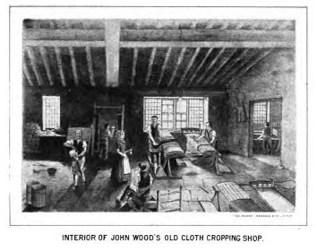

# The Huddersfield Luddites

In contrast to the stocking and lace-making trades of Nottinghamshire and Derbyshire, wool and the cloth-making trading was dominated the West Yorkshire town of Huddersfield, on the eastern edge of the Pennines.

The traditional process for producing woollen cloth had been to raise the nap on the freshly woven cloth using teasels, and then cut the fuzz from the cloth, leaving it smoother, using large shears that could weight 30*lbs.* (20 kilograms) or more.

But mechanisation was changing the game, first in the form of gig mills, smaller machines that could raise the nap; and then came the shearing frames, that cropped the cloth smooth.

```{admonition} The Woollen Trade, 1803
:class: dropdown

https://britishnewspaperarchive.co.uk/viewer/bl/0002429/18030226/015/0002
Oracle and the Daily Advertiser - Saturday 26 February 1803

THE WOOLLEN TRADE.

For the DAILY ADVERTISER AND ORACLE.

Respecting the discordant matters in the Woollen Manufactories, it is a pity Gentlemen in Parliament, who are to decide on the merits of a Bill to regulate trade, should not receive better information, or understand enough of the principle's to prevent so many misconstructions on Acts of Parliament, which, instead of rendering them clear and decisive, are too often found ambiguous and unintelligible, and this occasions much contention.

A few years since the Sheermen brought actions against the Clothiers for using the gig-mill to abridge their labour; and herein they failed, because in the Act of Parliament on which they proceeded it was described as a "burling machine," and Sheermen are not Burlers. This was tried at Salisbury.

It is now represented to Parliament that the Sheermen oppose "a certain chemical process;" this is wrong. It 'should have been said mechanical; for, it is machinery only which they oppose.

Manual labour is much taken off, and laws established by idle labourers, in clubs and secret committees, supported by compelling every individual to contribute a regular and equal portion, or be expelled from his trade. That the employer suffers much injury in his property, is cheated of labour for which he pays, and the credit of the cloths are affected to a serious degree in those countries where nocturnal depredations have prevented the use of gig-mills. This must introduce the sheering machines, which would render the manufacturers, in some degree, independent of these combinations, and greatly reduce manual labour. But the gig-mill has a contrary effect; for though it is a substitute for labour in raising wool on the face of the cloth, it produces so much more than Sheermen, by labour, will raise, that they are fully repaid in the extra business of cutting it off; and the cloth has a much more soft and delicate appearance.

A FRIEND TO TRADE, AN ENEMY TO COMBINATIONS, BUT NO MANUFACTURER, AND A CANDID OBSERVER.

N. B. Gig-mills in some parts of England have been in constant use for time immemorial, though so violently opposed in others.

Through every combination amongst workmen, none is so desperate, secret, or systematic as that of the Sheermen.
```

The Yorkshire croppers would surely have been aware of the actions being taking in Nottinghamshire. But even as a period of relative calm returned fifty miles to the south, direct action in the form of machine breaking started to appear in the villages and valleys around Huddersfield.

```{admonition} *"We learn with extreme concern..."*, February 1812
:class: dropdown

https://britishnewspaperarchive.co.uk/viewer/bl/0002646/18120227/018/0003
Star (London) - Thursday 27 February 1812

We learn with extreme concern, that in the neighbourhood of Huddersfield, within a short distance of that town, no fewer than twenty frames or machines have been broken, employed exclusively in the operation of cropping cloth. Serious apprehensions are entertained that further mischief will be committed, and the principal manufacturers who have availed themselves of this species of mechanism, are provided with arms and watchmen, to prevent such depredation.
```

```{admonition} Outrages in the neighbourhood of Huddersfield, February 1812
:class: dropdown

https://britishnewspaperarchive.co.uk/viewer/bl/0000076/18120229/011/0003
Leeds Mercury - Saturday 29 February 1812

MACHINERY DESTROYED

It is with deep regret we have to state that outrages of a most alarming description and extent, have been recently committed in the neighbourhood of Huddersfield. On the night of Saturday last, a number of persons assembled near the premises of Mr. Joseph Hirst, of Marsh, with their faces blacked, and their persons in other respects disguised, and having forcibly obtained admittance in to the dressing shops, proceeded to destroy all the machinery used in the dressing of cloth such as dressing frames, shears, and other implements used in what is commonly call Gig Mills, the whole of which they completely demolished. The same, or a similar party then proceeded to the workshops of Mr. James Balderson, of Crossland Moor, in which machinery of the same description was employed, in which they committed similar depredations, completely destroying or rendering useless the whole of the machinery. The manner in which these outrages were perpetrated, was this—The depredators, or to use the cant terms, Luddites, assemble with as much privacy as possible, at the place marked out for attack, and divide themselves into two parties, the more daring and expert of which enter the premises, provided with proper implements for the work of destruction, which they accomplish a with astonishing secrecy and dispatch. The other party remain conveniently stationed at the outside of the building, to keep off all intruders, or to give the alarm, if a superior force, was likely to be opposed to them. As soon as the work of destruction was completed, the Leader drew up his men, called over the roll, each man answering to a particular number instead of his name; they then fired off their pistols, (for they were armed,) gave a shout, and marched off in regular military order. They do not appear to have done any mischief besides breaking the machinery; and one of the party having asked the Leader what they should do with one of the Proprietors, he replied, not hurt a hair of his head; but that should they be under the necessity of visiting him again, they could not shew him any mercy.

The depredations appeared to the Magistrates to be of so alarming a nature, as to induce them to apply to General Vyse, of Beverley, for military aid, who dispatched an express to this town, with an order for the Troop of Scotch Greys stationed in this town, to proceed immediately to Huddersfield, and which marched at 11 o'clock on Monday night, for that place. And it not being thought expedient to leave this town without military, a squadron of Cavalry was marched from Sheffield, and arrived about nine o'clock on Tuesday morning, and in the afternoon of the same day, a squadron of the 2nd Dragoon Guards, arrived from York, and on Wednesday proceeded to Huddersfield, to relieve the Scotch Grey's who returned to this town on Thursday. The Cavalry from Sheffield left this place on Thursday morning. These military movements have naturally created much anxious curiosity, but no disposition has been evinced in this neighbourhood, to disturb the public peace.

On Wednesday night, notwithstanding the presence of the Military, a party broke into a Mill situated between Slaithwaite and Huddersfield, and carried on their work of destruction there in a similar manner.

```

A leader column in the *Leeds Mercury* repeated the call it had made previously in the context of the attacks in Nottingham and Derbyshire, recommending instead that those responsible eschew violence and machine breaking, and instead lobby against see the Order in Council as a major cause of their concerns.

```{admonition} Advice to those mistaken persons, February 1812
:class: dropdown

https://britishnewspaperarchive.co.uk/viewer/BL/0000076/18120229/008/0003
Leeds Mercury - Saturday 29 February 1812

The Mercury

We have more than once adverted to the unhappy disturbances at Nottingham, and as far as our influence and efforts could extend, endeavoured to convince the deluded people concerned in these outrages, that they had grossly mistaken the cause of their distress which originated, not in the use of machinery, but in the decay of trade, the unhappy effect of war, and the Orders in Council; we advised them to petition not for Peace, for we considered that as hopeless, but for the removal of the Orders in Council. For this conduct we were denounced as traitors, and branded as incendiaries; but it is a conduct we do not repent of: We offer the same advice to those mistaken persons who are now disturbing the peace of this county by similar outrages. The destruction of all the machinery in the kingdom would not contribute an iota towards relieving their distress. The proceedings they have adopted are most reprehensible and destructive, they tend to destroy the very bonds of society, they introduce into the very heart of the country a species of Civil War, they put those in a state of hostility with each other, who ought to be the best friends, and ultimately tend to introduce either general anarchy or complete military despotism. We would conjure them as they value their country, their wives, their children, their own lives, to pause in this destructive career, and to abandon, before it is too late, a system which can terminate only in misery and ruin.

```

In Huddersfield the magistrates and mill-owners formed a committee against the outrages, and offered a reward for the arrest of those who were responsible.

TO DO originally published as a hand-bill or poster, although it would not appear in the *Leeds Mercury* until almost a month later

```{admonition} Resolutions of a Committee against the outrages, February 1812
:class: dropdown
https://britishnewspaperarchive.co.uk/viewer/bl/0000076/18120328/013/0004
Leeds Mercury - Saturday 28 March 1812

100 GUINEAS REWARD

AT a General MEETING of the Magistrates, Merchants, Manufacturers, And Inhabitants of Huddersfield, and its Vicinity, convened by Notice, to be holden at the House of Mr. John Townsend, the George Inn, in Huddersfield, aforesaid, on Thursday, the 27th. Day of February, 1812;

*The following Resolutions were agreed to:*

It appears to the Meeting, that a violent and determined Spirit of Insubordination has gained much ground amongst the Workmen employed in various Trades and Manufactures, and particularly amongst the Shearmen, and that the same are organized and supported in a Manner, not only alarming to Trade in general, but to the peaceable Inhabitants of this Town and Neighbourhood in particular.

That we cannot sufficiently deprecate the Attempts to limit the Ingenuity of our Artificers, the employment of our Capital, and to prescribe the mode in which which the different Operations of our Trade shall be conducted, and particularly those now making in this Neighbourhood, for the Destruction of the Machinery used in the finishing of Woollen Cloth.

That the Destruction already committed upon this Kind of Machinery in this Neighbourhood, and the Threats of future Depredations, evidently proceed from an illegal Combination of Desperate Men; and we conceive it the Duty of all Men to suppress, as much as lies in their Power, such vicious and unlawful Combinations, and to assist and use their utmost endeavours, to detect and bring to Justice, not only the Perpetrators, but such as countenance and support them.

That a Subscription be immediately entered into, for the Purpose of procuring Information of the Proceedings of any illegal Combination, and of liberally rewarding any Person giving such Information as may lead to the Detection and Conviction of any such Offenders.

That the Management of this Subscription be under the Direction of a Committee, any Five of whom shall have power to act, as Occasion may require.

In Pursuance of the above Resolutions, a Subscription has been entered into, and the Committee hereby offer a Reward of

ONE HUNDRED GUINEAS

To any Person or Persons who will give such Information, so as to lead to the Conviction of any of the Parties recently concerned in Destroying the Dressing Frames of Mr. Joseph Hirst, of Marsh; Mr. James Balderson, of Crosland Moor; and Mr. William Hinchliffe, of Ley Moor, all near Huddersfield; and also the same Reward will be given to any Person or Persons, who will give private Information of the Intention of the Depredators to commit any further Mischief, so as such Information shall lead to the Apprehension and Conviction of any of the Offenders, and inviolable Secrecy will be observed.
```


```{admonition} A disposition to riot, March 1812
:class: dropdown
https://britishnewspaperarchive.co.uk/viewer/bl/0001476/18120302/017/0003
London Courier and Evening Gazette - Monday 02 March 1812

*The first part of the report also appears in e.g. [Star (London) - Tuesday 03 March 1812](https://britishnewspaperarchive.co.uk/viewer/bl/0002646/18120303/010/0004).*

We trust that the disturbances in Nottingham and to Vicinity are at an end: the Nottingham Paper of Saturday, which we received this morning, does not make any mention of disturbances during the last week. But a disposition to riot, we regret to state, has manifested itself near Huddersfield, in Yorkshire. Last Saturday week a number of persons assembled near the premises of Mr. Joseph Hirst, of Marsh, with their faces blacked, and their persons in other respects disguised, and having forcibly obtained admittance into the dressing-shops, proceeded to destroy all the machinery used in the dressing of cloth, such as dressing frames, shears, and other implements used in what is commonly called Gig Mills, the whole of which they completely demolished. The same, or a similar party then proceeded to the workshops of Mr. James Balderson, of Crossland Moor, where machinery of a similar description is employed, upon which they committed similar depredations, completely destroying or rendering useless the whole of the machinery. The depredations appeared to Magistrates to be of that alarming nature, to induce them to apply to Gen. Vyse, of Beverley, for military aid, who dispatched an express to Leeds, with an order for the troop of Scotch Greys stationed there, to proceed immediately to Huddersfield, and which marched at eleven o'clock Monday night, for that place. It not being thought expedient to leave Leeds without military, a squadron of cavalry was marched from Sheffield, and arrived about nine o'clock on Tuesday morning, and in the afternoon of the same day a squadron of the 2d Dragoon Guards stationed at the Barracks near York, were dispatched to Huddersfield, to relieve the Scotch Greys who returned to Leeds on Thursday.

We have not heard that any disposition to disturbance has manifested itself in any other part of Yorkshire.
```

As the Nottinghamshire attacks received attention in the West Yorkshire press, so too did events in the West Riding merit mentions in the Nottinghamshire press, albeit, very briefly.

```{admonition} A Temporary Peace, March 1812
:class: dropdown

https://britishnewspaperarchive.co.uk/viewer/bl/0001100/18120306/047/0004
Nottingham Review - Friday 06 March 1812

We understand that the disturbances have ceased, at least for the present, at Huddersfield. Small parties of the military guard all the gig mills near Leeds every night as a precautionary measure.
```

Despite an apparent respite from attack, owners of the gig mills, which were often worked in the smaller shops, were still fearful.

```{admonition} The Gig Mill Proprietors, March 1812
:class: dropdown
https://britishnewspaperarchive.co.uk/viewer/bl/0000076/18120307/009/0003
Leeds Mercury - Saturday 07 March 1812

Leeds, March 7.

No further depredations have been committed in this neighbourhood since our last; but so much alarm prevails among the proprietors of Gig-Mills, that a miliary guard is nightly stationed for their protection. And as it is necessary to have a still greater number on duty ready to act if occasion should require. It imposes a very severe duty on the troops stationed in this district. The Scotch Grays which have been in this town some time have received an order to march to Manchester, in which neighbourhood, there is collected a large military force, not less than 6000 men. This state of things is most deplorable, and if the evil should continue to increase, the whole military force of this country, will be insufficient to preserve its internal tranquility. The Scotch Grey's, which marched this morning, have been replaced by the second Dragoon Guards, which arrived here on Tuesday.

It appears that since the commencement of the *Luddite* system in the neighbourhood of Nottingham, 42 lace frames, and 544 plain silk and cotton stocking-frames have been destroyed: the value of the former, when new, is upon the average about 60*l.* each; and that of the latter from 18 to 20*l.* each. The most alarming apprehensions have been entertained for the safety of the county gaol; a strong guard has been placed both inside and out of it, ever since Monday last. Every person seems anxious to know whether the military will, as is usual, leave the town at the approaching assizes. The Mayor has received a letter, stating, that if any of the persons now confined for rioting, should be found guilty and punished, the town of Nottingham must answer for it, as they will set it on fire. The Luddites have raised betwixt 3 and 400*l.* for the purpose of having the first Counsel.

```

```{admonition} Alarm prevails, March 1812
:class: dropdown
https://britishnewspaperarchive.co.uk/viewer/bl/0002131/18120314/012/0004
Nottingham Journal - Saturday 14 March 1812

No further depredations were committed in the neighbourhood of Leeds last week; but so much alarm prevails amongst the proprietors of gig-mills, that a military guard is stationed for their protection. The Scots Greys, which have been in Leeds some time, have received an order to march to Manchester, in which neighbourhood there is collected a large military force, not less than 6000 men.

```


Threatening letter to Vickerman 1812 https://ludditebicentenary.blogspot.com/2012/03/before-15th-march-1812-threatening.html


```{admonition} Alarming accounts from Huddersfield, March 1812
:class: dropdown
https://britishnewspaperarchive.co.uk/viewer/bl/0000076/18120321/009/0003
Leeds Mercury - Saturday 21 March 1812

The accounts from the neighbourhood of Huddersfield, are this week very alarming:— About 8 o'clock on Sunday evening, a number of armed men with their faces disfigured, assembled upon the premises of Mr Francis Vickerman, of Taylor Hill, and announced their arrival by the discharge of a gun, two of the party rushed into the house and inquired for Mr. Vickerman, and as soon as he presented himself one of the men said, "Ned Ludd of Nottingham has ordered me to break this clock," and without further ceremony, forced the muzzle of his blunderbus into the clock face. Alarmed by the outrageous conduct and language of the depredators, Mr. Vickerman withdrew into a room above stairs, and a party of the *snappers*, as they are called, was placed as guard over the family, while a number of others proceeded to the work of destruction in the work-shops, and broke from 20 to 30 pairs of shears. Having effected their purpose, a volley from the fire arms was discharged into the parlour window, and a cupboard in the room, near which Mr. Vickerman was accustomed to sit, was perforated in several places by the balls, which on examination, were found to consist of the leaden seals or stamps usually placed at the ends of woollen pieces, made into a kind of slugs. Providentially, Mrs. Vickerman was placed with her afrighted children in such a situation in the room as to escape unhurt, and the men from within the house calling to them without, for God's sake to desist, the firing ceased. As soon as the shears were broken, the cry of "Out," "Out," proceeded from several voices; they then retired into a field, had their numbers to which they answered, called over, and they dispersed about half an hour before the arrival of the Military Guard, which it was known would be placed at nine o'clock. On entering the work-shops after the rioters had retired, it was found that not content with breaking the shears, they had wantonly laid a sheet of wool and two pieces of fine cloth upon the stove, which were nearly consumed, and in a few minutes, the premises, it is apprehended, would have been in a flame.

...

On Thursday week at Mansfield, a person was apprehended for stealing a club-box. He proved to be one of the *Luddites*, and confessed to acknowledge of the person who broke Shiply's frames, whose name is *Bull*; this man has since absconded. The prisoner has impeached near thirty of his comrades, nine of whom have been taken into custody, and many others have made their escape.
```

https://britishnewspaperarchive.co.uk/viewer/bl/0000239/18120324/008/0004
Manchester Mercury - Tuesday 24 March 1812

The Gazette of Tuesday contains a Proclamation offering a reward of two hundred guineas for the discovery and conviction of the persons concerned in the late outrages committed in the neighbourhood of Huddersfield, in Yorkshire.

More outrages were committed in the neighbourhood of Huddersfield, on Sunday week, in the evening.—The premises of Mr. F. Vickerman. of Taylor-Hill, were beset by the *Luddites* or *Snappers*, as they call themselves,—the cropping shears destroyed—several pistols fired into the house; however, without injury to any one,—and some wool set on fire.—The depredators retired before the arrival of a military guard, which they knew was expected about nine o'clock.




https://britishnewspaperarchive.co.uk/viewer/bl/0001100/18120327/040/0004
Nottingham Review - Friday 27 March 1812

We have received a letter from our Correspondent at Leeds, this morning. He says, "Contrary to my expectations, I have to inform you of further depredations committed by the populace. On Tuesday night, the warehouse of Messrs. Dickenson and Shann, in the Meadow_lane, of this town, was entered by the roof, and cloth to the value of £500 was cut and damaged. Messrs. Thompson and Co. thought it necessary to guard their gig-mill at Rawden, but on Monday evening, the watchmen were all surprised and secured, and the obnoxious part of the machinery was destroyed. Various reports are in circulation of damage done in other places, one report states that cloth to the amount of £4000 has been destroyed at Elland, near Halifax; most probably this is an exaggeration, but I believe there is some truth in it."

https://britishnewspaperarchive.co.uk/viewer/bl/0000076/18120404/009/0003
Leeds Mercury - Saturday 04 April 1812

A person of the name of Beswick, from Saddleworth, representing himself to be General Ludd, was on Wednesday se'nnight apprehended at a public-house in Huddersfield, with four of "his men," as he was pleased to call them, and placed in duress. The following morning the party underwent an examination before J. Radcliffe, Esq. and the men were discharged on entering into recognizances for their good behaviour for twelve months; but the General was re-committed, to undergo a second examination.

## Attack on Foster's Mill

At the start of April, the operations mounted by the machine breakers became increasingly ambitious. Following several smaller actions, on the night of Thursday, April 9th, 1812, there was a concerted attack on Foster's Mill at Horbury Bridge, a 10 mile walk or so from Huddersfield. In all, a reported 300 men or so, men who had marched in not just from Huddersfield, but also from the surrounding valleys, assembled with a single aim in mind.

```{admonition} Riots in Yorkshire, April 1812
:class: dropdown

https://britishnewspaperarchive.co.uk/viewer/bl/0000237/18120417/009/0003
Stamford Mercury - Friday 17 April 1812

RIOTS IN YORKSHIRE.— We are sorry to have to notice some fresh outrages in the West riding of the county. In the early part of last week, the work of destruction re-commenced in the neighbourhood of Huddersfield. The first sufferer was Mr. Smith, of Snowgate-Head, near Holmfirth: the rioters broke all his shears and dressing-frames. Horn Coat, about mile distant, was the next place of action: there they destroyed the frames and shears of Mr. Joseph Brook, broke his windows and demolished his furniture. Mr. James Brook, of Reins, near Honley, three miles from the last place, had also one frame broken, the only one he had, and which had been taken down several weeks.—But the most desperate riot was on Thursday night last, when upwards 300 depredators, armed with fire-arms, hatchets, and clubs, entered the cloth manufactory of Mr. J. Foster, of Horbury, near Wakefield; destroyed and injured every thing they could lay their hands on, whether belonging to the manufactory or not; ill-used the persons found on the premises; and lastly set fire to the building, but which was fortunately afterwards extinguished.—The damage is estimated 700*l.* 

```

```{admonition} Riots and Other Outrages, April 1812
:class: dropdown

https://britishnewspaperarchive.co.uk/viewer/bl/0000239/18120421/006/0003
Manchester Mercury - Tuesday 21 April 1812

Riots and other Outrages.

*Leeds, April 11.*—On Thursday night, about twelve o'clock, the extensive cloth manufactory of Mr. Joseph Foster, of Horbury, near Wakefield, was surrounded by a large body of armed men, who, after securing all the approaches to the proceeded to break into that part of the mill appropriated to the dressing of cloth, where they completely destroyed all the shears and frames; the former were not merely snipped, but absolutely broke pieces. They then demolished all the windows, and, as if actuated the most diabolical frenzy, broke into those parts of premises, against which these depredators do not pretend to have any ground complaint, the scribbling mill and weaving shops, and materially injured the machinery and wantonly damaged a quantity of warp ready for the loom, destroyed not merely the glass of the windows, but the frames which were of cast iron, the windows of the dyehouses, the counting-house, and even the dwelling-houses contiguous to the workshop shared the same fate. At the commencement of these dreadful outrages, a detachment from the main body invested the dwelling-house occupied by Mr. Foster's sons; they literally shivered the door in pieces, and broke both the windows & frames, and proceeded to the lodging-room of the young men, and demanded the keys of the building under pain of instant death. They dragged two of them out of bed, and tied them together, leaving them naked upon the floor; the other they compelled to accompany them with the keys, but this last outrage was quite unnecessary, as many practicable breaches had been already made in the building, and a considerable progress made in the work of destruction. The dwelling-house occupied by the book keeper was also broken into, and his family treated with the most brutal violence, and to complete the full measure of their guilt, they afterwards set fire to the building, but which was happily extinguished, After their departure before it communicated to the main body of the building, but not before very considerable damage had been done. The lawless men having accomplished their object, assembled in a neighbouring field, when the leader called over their numbers, to which each individual answered. Having ascertained that their whole number was there, said, "the work is done, all is well, disperse:" which order was obeyed.

*Leeds, April 13.*— The following account of the affair at Mr. Cartwright's mill, at Rawfold, between Cleckheaton and Littletown, may be depended upon as correct. About 20 or 30 minutes after twelve o'clock, on Saturday night, the Gig-Mill was attacked by the Luddites or Snappers, and the windows and door of the mill were assailed by a furious mob, who commenced their attack by the firing of arms and the beating of hammers and hatchets. The guard in the mill instantly repelled the assault by steady, firm and well-directed discharge of musquetry from within. A regular engagement succeeded, which continued from 15 to 20 minutes, during which time, not fewer than 140 shot were discharged from within. The assailants were foiled their attempt to force the windows or doors, and did no other damage than break the glass windows of the mill. The deluded mob did not escape unhurt. Two of the unhappy men were left wounded upon the spot, and there is great reason to believe that several more received the contents of the defenders' muskets, as traces of blood have been observed. The two wounded men were put under the care of surgeons as soon as could be done; one of them, John Booth, a tinner's apprentice, at Huddersfield, died after having had his leg amputated. Samuel Hartley, a cropper, Huddersfield, who worked with one Web or Webster, at the same place, (and formerly with Mr. Cartwright, at Halifax) was shot trough the breast; he died yesterday afternoon. From the direction of the shot, it is conjectured that he received his wound in the act of firing into the mill, or in an attitude similar to that of firing a musket. Several hammers, masks and picklock key were left upon the premises. Both of the men died without making any confession of their accomplices; but several must have been so wounded as to lead to the knowledge of them.

```

## Attack on Cartwright's Mill

Emboldened by the attack on Foster's Mill on April 9th, 1812, another ambitious affair was planned that would bring together men from Huddersfield and the Spen Valley in an attack on Cartwright's Mill at Rawfolds.

A round up of news in the *Hampshire Chronicle* summarised not just the attack on Foster's Mill, but also reported the attack on Cartwright's Mill.

```{admonition} Riots in the Country, April 1812
:class: dropdown

https://britishnewspaperarchive.co.uk/viewer/bl/0000230/18120420/008/0002
Hampshire Chronicle - Monday 20 April 1812

RIOTS IN THE COUNTRY.

On Thursday night, about 12 o'clock, a large body of armed men broke into the cloth manufactory of Mr. Foster, near Wakefield, and destroyed all the shears and frames, materially injured the machinery of the scribbling mill and weaving shop, damaged a quantity of warp ready for the loom, and committed other acts violence. They likewise broke into the dwelling-house occupied by the sons of Mr. F, dragged two of them out of bed, and tied them together, making them lie naked upon the floor, the other they compelled to accompany them with the keys. The dwelling-house occupied by the book-keeper was also broken into, and his family treated with the most brutal violence; and they afterwards set fire to the building, but which was happily extinguished, after their departure, before it communicated to the main body of the building, but not before very considerable damage had been done.

Sunday sennight, about twelve o'clock, a number of armed men, with their faces covered, entered the workshop of Mr. Smith, of Snowgate-head, Huddersfield, and broke all his dressing frames and shears. They next proceeded to Horn Coat, entered the dressing-shop of Mr. Joseph Brook, and not content with breaking his frames and shears, demolished his household furniture and all the windows. At Reims `(sic; Reins)`, near Honley, about three miles further, they arrived about two o'clock, and entered the workshop Mr. James Brook, and broke one frame, which was all he had, and which had been taken down 5 weeks.

...

Littletown, *(near Leeds), April 13.* — "I thought, after the recent trials and punishments, we should hear no more of the *Luddites*, at least for some time; but we had warm work in this neighbourhood on Saturday night last. The *Croppers* alias *Luddites* assembled to the number of from 150 to 200 men, with an intent to destroy Cartwright's cropping machines at Rawfold, not far from this town, and proceeded to break open the doors, but without effect, as they, as well as the windows, were extremely well secured with iron bars, and breast-works of flag-stones, and every precaution taken to frustrate their attempts. Cartwright is a resolute man, and having reason believe that his property would be attacked some night when he least expected it, took the resolution of sleeping the mill every night, with a little garrison consisting of six men. At the time the attack was made, two of the chosen band, (one of whom was soldier) refused to fight. Firing was kept up on both sides for a considerable time, and as it will appear not without effect. The rioters finding they could not get the door down with their hatchets and hammers, nearly shot it down. It was expected they would soon enter, but the invaders drew off and disappeared. Some are supposed to be thrown into the dam, and two wounded were lying near the building, one with leg broken (by a shot), which was soon after amputated, and he survived but a very little time. It is said he is a clergyman's son, about 19, apprentice to a tinner, at Huddersfield. The other was from Halifax, and had a bullet which took off part of the flesh of his arm, entered his chest, and went through. Mr. ———— saw him about 12 o'clock, when he seemed dying, and it is said he is since dead, but made no confession. They are known to each other by numbers, not by name. Other mills in the neighbourhood are guarded in a similar manner; and the proprietors, encouraged by this example, are determined to make the most vigorous resistance." 

```

The edition of the Manchester Mercury which had reported the attack on Foster's Mill also included a report of the Rawfolds mill attack from what looks to be the same letter, although with some differences in the extracted content.

```{admonition} Extract of another letter, April 1812
:class: dropdown
https://britishnewspaperarchive.co.uk/viewer/bl/0000239/18120421/006/0003
Manchester Mercury - Tuesday 21 April 1812


EXTRACT OF ANOTHER LETTER.

*Littletown, April 13.*—We had some warm work in this neighbourhood on Saturday night last. The Croppers alias Luddites assembled to the number of about 150 or 200 men, with an intent to destroy Cartwright's Cropping machines at Rawfold, not far from this town, and proceeded to break open the doors, but without effect, as they as well as the windows were extremely well secured with iron bars, and every precaution taken to frustrate their attempts. Cartwright is a resolute man, and having reason to believe his property would be attacked some night when he least expected it, took the resolution of sleeping in the mill every night, with a little garrison consisting of 6 men. At the time the attack was made, two of his chosen band (one of whom was a *soldier*) refused to fight. The contest began with an unequal force of five men against 150—but *"Thrice is he armed who hath his quarrel just."*— Firing was kept up on both sides for a considerable time, and it will appear, not without effect: Cartwright and his party fired 140 times from his windows; some of the Luddites were killed, and several wounded, I have seen two of these poor deluded men dead, who have fallen a sacrifice to their temerity; another is reported to have since died of his wounds, and how many more are languishing remains to be ascertained. Cartwright and his men were so well protected behind the walls, that they escaped unhurt, but they frequently exposed themselves and fought like heros, particularly the GOVERNOR.— Cartwright and his guard kept watch every night in the event of a renewal of the attack.
```

```{admonition} New disorders in the neighbourhood of Leeds, April 1812
:class: dropdown

https://britishnewspaperarchive.co.uk/viewer/bl/0002131/18120418/031/0003
Nottingham Journal - Saturday 18 April 1812

We lament to state new disorders in the neighbourhood of Leeds. The following are the particulars, given in a letter:

"Heckmondwike, April 12.—On rising this morning found the rioters had attacked Mr. Cartwright's mill at the Rawfolds, just beyond Little Town, who is, it seemed, a very spirited man, and was well prepared for them, having himself, with eight soldiers, slept in the mill for some time, and had well barricaded it. It was secured on the back by the dam; breast-works of large flag-stones were put before the windows, leaving apertures for those inside to put their firelocks through. A sentinel was placed on the outside, whom the rioters surprised and disarmed. In the mill all were asleep, bus one, when the attack commenced. Mr. C. with true courage, said, "Now, my lads, they are come, be steady." His party being placed behind the flag-stones, he went to the middle window and fired (as he saw occasion) from side to side. The soldiers say, they never saw a man fire and load so fast. The rioters finding they could not get the door down with their hatchets and hammers, nearly shot it down. It was expected they would soon enter, when Mr. C. ordered the soldiers to fix bayonets, declaring he would shoot the first that flinched; but the invaders soon drew off, and disappeared. Some are supposed to be thrown into the dam, and two, wounded, were lying near the building, one with a leg broken (by a shot), which was soon after amputated, and he survived but a very little time. It is said, he is a clergyman's son, about 19, apprentice to a tinner, at Huddersfield. The other was from Halifax, and had a bullet, which took off part of the flesh of his arm, entered his chest, and went through. Mr. ——— saw him about 12 o'clock, when he seemed dying, and it is said he is since dead; but made no confession. We hope this will deter from further proceedings. They are known to each other by numbers, not by name. Other mills in the neighbourhood are guarded in a similar manner, and the proprietors, encouraged by this example, are determined to make the most vigorous resistance."

Another letter from a gentleman at Halifax, to his friend in this neighbourhood, dated April 14, says, "The *Luddites*, for so we have begun to call them, have met with a rebuff in this neighbourhood: Mr. Cartwright, late of this town, now of Cleckheaton, has had his mill in a state of defence for some time past; on Saturday night, or rather Sunday morning, it was attacked; Mr. Cartwright and his friends were prepared, and a smart engagement took place for about eighteen minutes, in which time Mr. C.'s men fired 140 cartridges. The cavalry then came up, and the assailants were dispersed. Two of them were left severely wounded, one in the thigh, the other in the breast. The former submitted to amputation, but died in an hour after the operation; the other died also in the course of the day: both sullenly refused to give any information.—Blood has been traced two or three miles from the place, in various directions, since the flight of the insurgents, and a finger has been picked up. It is hoped that so firm and successful a resistance will stop the progress of these deluded men in their lawless aggressions.—Mr. Cartwright is a spirited man, and has been in the army."

A spirit of riot and disorder has been manifested at Sheffield, in consequence of the high price of provisions and want of employment. On Tuesday last a large mob of men, women, and children, assembled in the principal streets, and as if conformity to some previously concerted plan, the whole body rushed with violent exclamations to the Town Magazine, which they forced open, and carried off, or destroyed, in a few seconds, the whole of the arms and ammunition, &c. on which they could lay their hands, belonging to the Local Militia. The Magistrates, however, exerted themselves so successfully in quelling the tumult, that no further mischief has been done. A strong military force is kept on duty.

Some acts of violence, from the same causes, have also this week been offered by the weavers - at Stockport.
```


```{admonition} TO DO
:class: dropdown

https://www.britishnewspaperarchive.co.uk/viewer/bl/0000076/18120418/010/0003

Leeds Mercury - Saturday 18 April 1812

*Also appears in Chester Courant - Tuesday 28 April 1812 https://www.britishnewspaperarchive.co.uk/viewer/bl/0000388/18120428/007/0004*

RIOTS

FATAL CONFLICTS

We have made it our business to collect a faithful narrative of the sanguinary contest that last Saturday night took place at Rawfolds, between the men calling themselves the army of General Ludd and the persons employed in guarding the property of Mr. Cartwright, in order to place upon record the particulars of an event that will survive in local remembrance the present generation; and we can undertake to say, that the following narrative may be implicitly relied upon: —

It is known to our readers that the use of machinery for raising and dressing woollen-cloth has of late become very unpopular amongst the shearmen in this part of the country; and that all mills where machinery this kind is in use have been marked out for destruction, and that in several of them the obnoxious machines have been destroyed.

At Rawfolds, near Cleckheaton, a place at an equal distance from Huddersfield and Leeds, from each of which it is about eight miles, a gentleman of the name of William Cartwright has a mill used for the purpose of dressing cloth in the way objected to by the men; on this mill it was understood that an attempt was to made, and on Thursday night, the 9th inst. the centinel at the mill observed several signals that were supposed to indicate an approaching attack, though both that and the following night passed over without molestation. On Saturday night, about half-past twelve o'clock, there was a firing heard from the north, which was answered from the south, and again from west to east; this firing was accompanied by other signals and in a few minutes a number of armed men surprised the two centinels without the mill, and having secured both their arms and their persons, made violent attack upon the mill, broke in the window-frames, and discharged a volley into the premises at the same instant. Roused by this assault, the guard within the mill flew to arms, and discharged a heavy fire of musketry upon the assailants; this was returned and repeated without intermission during the conflict, the mob attempting all the time to force an entrance, but without success, a number voices crying continually "Bang up!" Murder them!" "Pull down the door!" — and mixing these exclamations with the most horrid imprecations. Again and again the attempts to make a breach were repeated, with a firmness and constancy worthy a better cause; but every renewed attempt ended in disappointment, while the flashes from the fire-arms of the insurgents served to direct the guards in their aim. For about 20 minutes this engagement continued with undiminished fury, till at length, finding all their efforts to enter the mill fruitless, the firing and hammering without began to abate, and soon after the whole body of the assailants retreated with precipitation, leaving on the field such of their wounded as could not join in the retreat. An attempt was made to rally their scattered forces, to carry off their wounded, but it was in vain; the fire from within had been kept up with so much steadiness and perseverance as to produce universal dismay; during this spirited engagement 140 balls were discharged from the mill; what number of shots were fired by the mob, it is impossible to say, but the doors and windows were perforated with a vast number of pistol and musket balls, though none of them took effect, not one of the guards having sustained the least persona] injury. During the principal part of the engagement the alarm-bell was rung, and a quantity of large stones were hurled from the roof, which had an instantaneous effect, otherwise a quantity of oil of vitriol, in reserve, would have been poured down.

On the cessation of the firing, the ears of the guards were assailed with the cries of two unfortunate men, weltering in their blood, and writhing under the torture of mortal wounds:— "For God's sake," cried one of them, "shoot me— put me out of my misery!" — "Oh!" cried the other, "help! help!—I know all, and I will tell all." On the arrival of a detachment of the Queen's Bays, which took place about an hour after the attack commenced, these ill-fated men were removed on litters from the field to the Star Inn, at Robert Town, and medical aid was called in with all possible dispatch. One of them proved to be a cropper, of the name of Hartley, formerly in the employment Mr. Cartwright; a fine-looking young unmarried man, about 24 years of age, and a private the Halifax Local Militia, in which regiment Mr. Cartwright is Captain. The other was John Booth, a youth about 19 years of age, son of a clergyman in Craven, and an apprentice to Mr. Wright, of Huddersfield, tinner. Hartley had received a shot in his left breast, apparently while making a blow at some part of the mill, which, passing through his body, lodged beneath the skin at the left shoulder, from whence it was extracted with a portion of bone. In this situation he languished till three o'clock on Monday morning, when he expired. Booth's wound was in his leg, which was shattered almost to atoms; it was found necessary that he should submit to have the leg amputated, but owing to the extreme loss of blood before the surgeons arrived, spasms came on during the operation, and he died about six o'clock on Sunday morning; having previously observed, that if he should recover, "he would never be brought into such a scrape again." It was observed that neither of these victims of lawless violence manifested any sense of religion. Booth was interred at Huddersfield, on Thursday morning, at six o'clock and Hartley at Halifax, on Wednesday; and they were both attended to their graves by a vast concourse of spectators. `[In the Chester Courant, this last sentence is replaced by: "On Monday a Coroner's Inquest assembled upon the dead bodies, and returned a verdict of— *Justifiable Homicide*. None of the wounded men except Hartley and Booth have yet been discovered."]`

On the morning after the engagement a number of hammers, axes, false-keys and picklocks, with two masks, a powder-horn, and a bullet-mould were found upon the field, which was stained in several places with blood: and it is evident that many others besides those left on the field were wounded, as traces of gore were distinctly traced in almost every direction, and in one place to the distance of four miles. The assailants have much to rejoice that they did not succeed in entering the building, from we speak from our own observation when we say, that had they effected an entrance, the death of a vast number of them from a raking fire which they could neither have returned nor confronted, would have been inevitable. It is unnecessary to speak of the heroism of the little band that guarded these premises, there is not perhaps upon record a more distinguished instance of cool intrepidity; but it may be proper to add, that the number of military on the mill was very small, and one of that number conducted himself in so unsoldierlike a manner, that he was on the following morning placed in a confinement, and now awaits the issue of a Regimental Court Martial. `[The Chester Courant differs slightly: *though the assailants exceeded hundred, the numbers opposed to them were very inconsiderable*.]`

A number of reflections arise out this narrative, but we shall content ourselves with one remark: we have of late frequently deemed it our duty, from the regard we feel to the labouring classes, and to the laws of our country, to warn those that are engaged in these violent proceedings, of the fatal consequences that await them in the unequal contest in which they are now waging with the civil and military power of the country. —Let them reflect deeply on the fate of Hartley and Booth—let them recollect that they themselves may be the next victims, and let them stop this desperate career before it is too late.— On Monday a Coroner's Inquest assembled upon the dead bodies, and returned a verdict of— *Justifiable Homicide*. None of the wounded men except Hartley and Booth have yet been discovered.

On Thursday se'nnight about twelve o'clock at night, the extensive Cloth Manufactory of Mr. Joshua Foster, of Horbury, was surrounded by a large body of men, armed with muskets, hatchets and clubs, who broke into the Dressing-shops and totally destroyed all the shears and frames and other utensils used in the finishing of cloth; but not content with this, they did considerable injury to the machinery employed in the other part of the business, and respecting which they do not profess to have any ground of complaint. The doors and windows were also broken in pieces, and the damage done to the latter is estimated at 100*l.*. and to conclude the whole, set fire to the premises, but which was happily extinguished before it communicated to the main body of the building At the commencement of these outrages, a party of about twenty broke into the Dwelling-house by the sons of Mr. Foster, whom they treated with the utmost indignity, compelling two of them to get out of bed and lie upon the floor tied together, and obliged the other to give up the keys and go with them to unlock the doors; but this ceremony they might have dispensed with, as the great body of the depredators had already effected many practicable breaches and made an considerable progress in the work of destruction, The Dwelling-house of the Book-keeper was also broken into and his family treated with the most brutal violence. Previous to the assault these assailants had the precaution to secure all the approaches to the premises, and after the work of destruction was completed, their leader assembled them in a neighbouring field, called over the muster-roll, and each man having answered to his number, told them "that their work was done, and all was well, and might disperse." The number assembled on this occasion was about 400, about eight of whom were mounted on horses. Several discharges of fire-arms took place; but it is imagined to be only with powder, as no marks of any shot were observed.

HUDDERSFIELD- This place has been all hurry and confusion during the present week, but no depredations have been committed.— A special sessions was holden here on Monday last, and several persons underwent examinations before the Magistrates respecting the late desperate attack at Mr. Cartwright's mill, but nothing material could be discovered. — The Magistrates came to the resolution of enforcing the Watch and Ward Act in this town.—Booth, who died of his wounds, was interred here at 6 o'clock on Thursday morning, great numbers of people poured in from all quarters during the morning in expectation of seeing the funeral which was over before the majority of them arrived; all is now quiet.— Huddersfield wears the aspect of a town under military power night and day.— What will Napoleon say to this?`[This paragraph was widely syndicated, but the last sentence is typically replaced by "Hartley was interred at Halifax the preceding day with considerable parade; a number of the persons who followed him to his grave were dressed in mourning and wore round their arm a bandage of white crape."]`

```


TO DO 

```{admonition} The men left at Cartwright's Mill
:class: dropdown seealso

The two men left at Cartwright's mill, who were to later die of their wounds, were:

- *John Booth*, aged 19, apprentice saddle-maker and son of a clergyman;
- *Samuel Hartley*, aged about 24, a cropper, who had formerly worked for Cartwright, and a member of the Halifax militia.

```

```{admonition} TO DO
:class: dropdown

https://www.britishnewspaperarchive.co.uk/viewer/bl/0000062/18120505/015/0003
Hull Packet - Tuesday 05 May 1812

A person of the name of Haigh was apprehended at Methley on Saturday se'nnight, on suspicion of having been concerned in the late attack upon Mr. Cartwright's mill. This man, who appears to have received a wound from a musket-ball in his shoulder without being able to give any satisfactory account of the cause of that wound, has undergone several examinations before Mr. Radcliffe, of Milnsbridge, and was on Thursday committed to York Castle. On Thursday he passed through Leeds, in a chaise and four, on his way to York, escorted by twelve dragoons. Two other wounded men `[elsewhere (e.g. Pilot (London) - Tuesday 05 May 1812 ) named as "Charles Cockroft and one Stocks"; Stock (sic) was liberated, but Cockroft remanded.]` have been in custody all the week on a similar charge, but we have not heard the result of their examination.
```


TO DO


[ALso see elsewhere for more on Horsfall; the following is duplicated in that but included here to give a sense of the timeline of the reports.]

https://www.britishnewspaperarchive.co.uk/viewer/bl/0000076/18120502/011/0003
Leeds Mercury - Saturday 02 May 1812

ATROCIUS MURDER. On Tuesday evening last, at about half past six o'clock, as Mr. WILLIAM HORSFALL a very extensive Woollen Manufacturer at Marsden, about seven miles from Huddersfield, was returning from the market at that place, he was assassinated on the public road, on Crossland Moor.

The circumstances, as stated to us by an eye-witness of this most barbarous Murder are these:— Mr. Horsfall and a Manufacturer, of the name of EASTWOOD, had left Huddersfield together, and at a short distant before they came to the fatal spot, Mr. Eastwood stopped to water his horse, while Mr. Horsfall rode leisurely along the road; when he had came within about 500 yards of the Warren Inn, a distance of about a mile and a half from Huddersfield, on the Manchester road, four men, each armed with a horse pistol, who had just before stepped out of a small plantation, placed the barrels of their pistols in appertures in the wall, apparently prepared for that purpose; the muzzel of two of these pieces Mr. Horsfall distinctly saw, but before he had time to extricate himself from his perilous situation, they all four fired, and inflicted four wounds in the left side of their victim, who instantly fell from his horse, and the blood flowed from the wounds in torrents. A number of passengers both horse and foot rushed almost instantly to the spot, and, after disentangling his foot from the stirrup, he was some difficulty got to the Inn.

The Murderers, after they had perpetrated the sanguinary deed, walked to the distance of some yards, and soon after briskening their speed, they ran towards Dungeon Wood, and entirely escaped undiscovered, no pursuit or search having been made after them, till the arrival of a troop of the Queen's Bays, about three quarters of an hour afterwards. One of the Assassins is described to us as about six feet high, another as a low portly man, and the two others as about five feet six or seven inches high, and rather slender; they all wore dark coarse woollen coats, and appeared to be working men.

From a professional Gentleman, who was called in to visit Mr. Horsfall, we learn, that three of the wounds, out of the four, were slight, and unattended with danger, but the fourth made by a musket ball, which entering the abdomen on the left side had taken a downward direction, and lodged in the back part of the right thigh, from which it was extracted on Wednesday, along with a pistol ball, at which time, some faint hopes were entertained of the patient's recovery; but on Thursday morning, about five o'clock, a profuse bleeding came on, accompanied by mortification, by which the thigh was swollen to an enormous size, and between eight and nine o'clock that morning, he expired, in perfect possession of his faculties.

Mr. Horsfall had a very large Woollen Manufactory at Marsden, wherein about 400 work people were employed; and in a part of his premises there are Shearing Machines, which have been erected about seven years, and have attained considerable perfection; this circumstance, with the additional one of his unremitting activity in detecting, and bringing to justice the persons engaged in the attack at Rawfolds, and other Mills, had rendered him obnoxious in a high degree to the machine destroyers, who knowing his premises were too well defended to justify an attack on his property, committed a crime against his person, that will embitter every future day of their existence, and, that will, in all probability through the retributive justice of that Being, from whom no secrets are hid, bring the blood-stained perpetrators of this worst of crimes, to an ignominious end.

A reward of £2000 will, we understand, be offered immediately to any person who will give such information as will lead to the conviction of any one or more of the four men concerned in the murder of Mr. Horsfall.


https://britishnewspaperarchive.co.uk/viewer/BL/0000045/18120504/005/0003
Caledonian Mercury - Monday 04 May 1812

On Saturday se'ennight a regimental court-martial was held at Huddersfield, on a private who misconducted himself at the attack on Rawfold-mill, in refusing or neglecting to defend it in the manner he might have done. He was found guilty of neglect of duty, and was sentenced to receive 300 lashes. On Tuesday morning he was marched, escorted by a detachment of dragoons, to Rawfold, the scene of action, where he was tied up, and received about 25 lashes, the remainder of his punishment being remitted at the earnest and repeated intercession of Mr Cartwright.

On Saturday se'ennight an attempt was made to assassinate Mr Cartwright, the intrepid defender of Rawfold's Mill, by two villains who fired at him from behind a hedge, as he was returning from Huddersfield. The shots were discharged at nearly the same moment from opposite sides of the road, but happily without effect.

https://britishnewspaperarchive.co.uk/viewer/bl/0000045/18120507/005/0003
Caledonian Mercury - Thursday 07 May 1812


[ATROCIOUS MURDER article from Leeds Mercury, prefaced with:

We formerly mentioned, that Mr Horsfall, of Marsden, had been waylaid, on his return home from market, by a gang of villains, by whom he was fired at and severely wounded. We are sorry to learn, by the following account, extracted, from the Leeds Mercury of Saturday last, that Mr Horsfall has since died of his wounds.

...

Mr Cartwright, who so bravely defended his property in Yorkshire, has been fired at on three distinct occasions but without doing him the slightest injury.

Mr Trentham, notwithstanding his alarming wound, is likely to recover. The Luddites have had the audacity to placard the streets of Nottingham in the night, offering a reward for Mr Wilson, the mayor, dead or alive. He had committed no offence than signing the offer of a reward of L.600 from the Corporation of Nottingham, for the discovery of the assassin who shot Mr Trentham. — These infatuated men are said actually to meet in the streets of Nottingham, in small parties, in the daytime, and triumphantly talk over their nightly depredations.

The Gazette of last Saturday offers his Majesty's pardon, and a reward of L.2000, for the conviction of the persons who shot Mr W. Horsfall, of Marsden, near Huddersfield, on Tuesday se'ennight, of which wounds he is since dead.— Also L. 600 reward, and a pardon, for the person who fired at Mr W Trentham, of Nottingham, on the evening of Monday se'ennight, as he was knocking at his own door, and wounded him in the breast.— L.100 for the person who discharged a gun at Mr J. Rayner, of Lendthwaite, West Riding, on the 23d April, the ball of which went through his hat.— 100 guineas, and a pardon, for the discovery of the person who discharged a gun at Mr. E. Whitehead, deputy constable, at Huddersfield, as he was going to bed, on the 15th ult.— And L.200 for the conviction of the persons who, on the night of the 21st of March, fired upon the boat's crew of his Majesty's schooner Pioneer, after she had chased three smuggling galleys on shore between Walmer and Deal, and by which two of them escaped.

Accounts from Manchester state, that another mill has been burned near that town, and a woman, who offered to give evidence against the criminals, was shot, while the military were escorting her to the magistrate.

Letters from different parts concur in stating, that the great tumults have subsided, but that shocking outrages are committed by small parties of depredators and assassins.

The most urgent representations, we hear, have within these few days been made to Government, that a renewal of disturbances might be expected in the northern counties, unless a greater proportion of troops was immediately sent down and quartered in those districts. It is said to have been ascertained by the Magistracy, that a regular organization had commenced in several places, and even oaths of fidelity and secrecy been administered to these deluded people. During the last week, not fewer than seven regiments have proceeded towards Cheshire and Lancashire. The provincial papers are filled with accounts of the movements of the military.

A Special Commission will shortly be sent down to Chester and Lancaster to try the rioters (about 30) who have been committed to gaol in those counties.


https://www.britishnewspaperarchive.co.uk/viewer/bl/0001659/18120508/006/0001
Drakard's Stamford News - Friday 08 May 1812

ALARMING RIOTS

Letters from different parts concur in stating, that the great tumults have subsided, but that shocking outrages are committed by small parties of depredators and assassins.

Mr. Cartwright, who so bravely defended his property in Yorkshire, has been fired at on three distinct occasions; but without doing him the slightest injury.

Mr. Trentham, notwithstanding his alarming wound, is likely to recover. The *Luddites* have had the audacity to placard the streets of Nottingham in the night, offering a reward for Mr. Wilson, the mayor, dead or alive. He had committed no other offence than signing the offer of a reward of £600 from the Corporation of Nottingham, for the discovery of the assassin who shot Mr. Trentham. These infatuated men are said actually to meet in the streets of Nottingham, in small parties, in the day time, and triumphantly talk over their nightly depredations.

HUDDERSFIELD, *April* 30, 1812.—A most melancholy circumstance took place in this neighbourhood yesterday evening. As Mr. W. Horsfall (a partner in the house of Horsfalls and Co. of this town) was returning to his house at Marsden, about seven miles off, he was shot at by some desperate villains, concealed in a plantation by the turnpike road side, on Crosland Moon, about two miles from Huddersfield,. Mr, H, cried out, "I am shot, I am murdered!" and turned his horse round, as if intending to go to a public-house about two or three hundred yards below the plantation; four-men made their appearance on the wall, but Mr. H, immediately fell from his horse, and they then went into the wood and were seen no more! It is supposed that no less than four slugs were discharged at him, one of which only has been extracted. The shots took place near the groin and on the lower part of the abdomen. Mr. H, was concerned in a mill where shear frames are used for dressing cloth, and it is his undaunted resolution in resisting the daring association of frame-breakers, called '*Luddites*,' that has marked him out for the vengeance of those lawless ruffians.

It is said to have been ascertained by the magistracy, that a regular organization has commenced in several places, and even oaths of fidelity and secrecy have been administered.

On Tuesday night a body of ten or twelve men, with their faces blackened, attacked the watchman belonging to the premises of Messrs. Home, manufacturers, in Denton-holm, in consequence of some information he is said to have given respecting the rioters. The poor man was most dreadfully beaten, the assailants then compelled his wife to deliver up his fire-arms, with which they decamped.

MANCHESTER, *April* 26.—On Friday afternoon, about four o'clock, "a large body of rioters suddenly attacked the weaving factory belonging to Messrs. Wroe and Duncroft, at Westhougton, about 13 miles from this town; of which, being unprotected, they soon got possession. They instantly set it on fire, and the whole building, with its valuable machinery, cambrics, &c. were entirely destroyed. The building being extensive, the conflagration was tremendous. The damage sustained is immense, the factory alone having cost £5000. The reason assigned for this horrid act is, as at Middleton, "weaving by steam." By this dreadful event, two worthy families have sustained a heavy and irreparable injury, and a very considerable number of poor are thrown out of employment.

MANCHESTER, *May* 2.—This town is completely tranquil. We have been, in the course of a few. days, furnished with two regiments of Militia and a few field pieces.

LEEDS, *May* 2.—A person of the name of James: Haigh, a cloth-dresser, of Dalton, near Huddersfield, was apprehended at Methley last Saturday night, on suspicion of having been concerned in the late attack upon Mr. Cartwright's mill. This man, who appears to have received a wound from a musket-ball in his shoulder without being able to give any satisfactory account of the cause of that wound, has undergone several examinations before Mr. Radcliffe, of Milnsbridge, and was on Thursday committed to York Castle. On Thursday evening he passed through Leeds, in a chaise and four on his way to York.

A Manchester paper, after mentioning the burning of the factory at West-Houghton, on the 24th ult. adds— "It was known that many other factories and mills were to meet the same fate, and also the lives of many respectable persons were threatened. However, by a well conceived project, most judiciously executed, their secret meetings were dashed into, their private signals obtained, and by a patient and persevering duty of detachments of the Bolton Local Militia, their nocturnal assemblies were put to confusion, their papers seized, and a very large number of their ringleaders, (together with a person they called General Ludd, who administered impious and rebellious oaths) have been accused, and sent to Lancaster Castle."

The famous General Ludd is among the prisoners last committed to Chester Gaol, for rioting and seizing flour and other articles, at Gee Cross, and being particularly active in making seizures.—This man (William Walker), a collier from Werneth, was considered as an active leader, marched before the deluded mob in a large cocked hat, and was distinguished by the appellation of General Ludd.

The soldier, who -failed in his duty when the populace attacked Mr. Cartwright's at Rawfolds, has been tried by a Court-martial, and sentenced to receive 300 lashes. On Monday se'nnight, he was marched to Rawfolds to receive his sentence; but owing te Mr. C.'s interference, the punishment was mitigated to 25 lashes.

The Spirit of Riot seems to have extended itself at length to Liverpool. A mob of about 500 people suddenly assembled with a view to the destruction of some manufactory in that neighbourhood; but intelligence. being gained of the intention of the same, timely precautions were adopted, and property to the amount af £10,000, was saved.

One thousand sacks af flour have been sent from Plymouth dock to the relief of the miners in Cornwall.

A meeting of the Magistrates and neighbouring Gentry was held last week at Carlisle, which was numerously attended by the townspeople and workmen. Some of the weavers stated, that in consequence of the low price of labour, they were compelled to perform twice the former quantity of work, and thus nearly double the quantity of goods was manufactured, by the same number of hands, as otherwise would have been; that they had previously presented a petition to the Magistrates for advance of wages; and that, though promises of an advance had, on a recent occurrence, been held out, these promises were no longer regarded. The meeting broke up without doing any thing, A deputation of weavers waited on Mr. Christian, with a Petition, in which were abstracts from two Acts of Parliament, asserting the power of the Magistrates to regulate the price of manual labour. Mr, C. promised them, that as soon as possible his father, Mr, Curwen, would hold a meeting of the Magistrates, when their Petition should be duly considered.


```{admonition} TO DO
:class: dropdown

https://www.britishnewspaperarchive.co.uk/viewer/bl/0000239/18120512/002/0002
Manchester Mercury - Tuesday 12 May 1812

Committed to York Castle.— James Haigh, of Dalton, cloth-dresser, charged upon the oath of Joseph Ardron, and other persons, as strongly suspected of having been one of the persons who, on the night of the 11th of April, riotously assembled and attacked the mill of Mr. W. Cartwright, at Rawfolds. —This man was apprehended at Methley, on Saturday week. It appears that since the attack above mentioned, he had been first at the house of a sister in-law, at Penistone, from whence he went to another sister at Methley. He was taken before Joseph Esq. of Milnsbridge, and after undergoing several examinations was fully committed on Thursday. He was conveyed to the Cattle in a chaise and four, escorted by a party of dragoons. —Two other men were apprehended as accomplices at Hill-House, near Huddersfield, on Monday evening, after several examinations, one of them named Stocks was liberated, but the other, Cockroft, was remanded.—On Monday night, it is strongly suspected, with a view to the rescue of the above men, the stable of Major Gordon, at Huddersfield, was set on fire, and nearly destroyed. The stratagem, however, failed; for instead of drawing away the guard which was placed over the prisoners, the officer, with great promptitude, doubled its force. Happily the fire did not communicate to any other building.
```


https://www.britishnewspaperarchive.co.uk/viewer/bl/0000488/18120509/004/0003
Lancaster Gazette - Saturday 09 May 1812

*Local Militia.*—The present perturbed state of the country has induced Government to call forth the aid of the Local Militia regiments in those districts which have been the scene of unlawful outrages.—Six companies of the Chester Local Militia regiment, and a part of the artillery, marched to Stockport on Wednesday.

At a meeting of the Deputy Lieutenants of this county on the 1st inst. it was resolved to order out immediately one-third of each regiment of Local Militia throughout the county:—In consequence of which, four companies of the Lonsdale regiment assembled in this town on Monday last; on which day also four companies of the Amounderness regiment assembled at Preston; and four companies of the Blackburn Hundred Lower Division regiment assembled at Blackburn. The remainder of the Lonsdale regiment are to assemble here on Monday next.

On Wednesday last, about 500 of the Berkshire Militia arrived at Preston, and were followed on Thursday by about 200 more. They are to remain there till further orders.

"This town, we have the peculiar satisfaction of observing, continues to enjoy a state of uninterrupted tranquillity , and there is no reason to apprehend any return of insubordination. We have had a very considerable influx of soldiers. The Buckinghamshire militia, 800 strong, with two field-pieces attached, commanded by Col. Young, marched from Mansfield on Wednesday, and arrived here on Thursday evening. On Friday, the Berkshire, (Col. Vansittart) consisting of upwards of 600, reached here from Nottingham, under the command of Lieutenant-Col. Ravenshaw. The greatest part of the Manchester and Salford Local Militia, commanded by Col. Silvester, and the Newton and Failsworth, by Lieut Col. Keymer, have been called out, and it is gratifying to state that they assembled with commendable alacrity. 132 persons have already been sworn in under the Watch and Ward Act, for Salford, and upwards of 2000 for Manchester and the several other townships."- *Manchester Mercury*, May 5.

We are deeply concerned in stating, that in the neighbourhood of Bolton, Chowbent, Leigh, and Tyldesley, a secret system of organized riot, approaching to rebellion, has been carried on for some time. Many factories and mills were to be destroyed, and the lives of many respectable persons were threatened — By a well-conceived project, however, most judiciously executed, these secret meetings have been laid open, the private signals of the conspirators obtained, and by a patient and persevering duty of detachments of the Bolton Local Militia, their diabolical nocturnal assemblies are routed, their papers seized, and a great number of their ringleaders, (together with a person they call General Ludd, the grand administrator of impious rebellious oaths) have been secured, and sent to our Castle—Amongst the papers seized, is a roll containing a list of names of great numbers implicated, all of whom await the punishment of their country. The Magistrates are indefatigable —”Much praise is due to Capt. Buller, of the Greys, and to his troop; and to Major Pilkington, and to his troop, whose services have been eminent; and we feel particular pleasure in mentioning the steady, loyal, and soldier-like conduct of the Bolton regiment of Local Militia, who, upon every occasion, act like veterans.

We cannot but deprecate the mode of exaggerating the proceedings of the rioters in different parts, and spreading unfounded reports of their numbers, &c.—The Chester Courant of Tuesday last contains the following paragraph:— "We understand there are upwards ol 100 persons now confined in Lancaster Castle, charged with rioting." We can assure the public, that in addition to the twenty-nine persons mentioned in our last, as being committed for that and other offences, four more only arrived, under an escort, on Sunday last, charged with setting fire to the factory at West Houghton, near Bolton.

...

*Rioters committed and sent off to Lancaster by the magistrates of Manchester.*— John Howard, Nathaniel Hilton, Richard Sothern, John Atkinson, John Lee, Thomas Hoyle, Henry Ashton, Phoebe Smith, Hannah Smith, John Oakes, Samuel Crossley, and Thomas Brookes; the three last from Worsley.

John Bird has been committed, but not yet sent off.

Jos. Thompson has been committed to Chester, charged with being concerned in the tumults at Mr. Goodair's house, at Stockport.

*Committed to York Castle* —”James Haigh, of Dalton, in the West Riding, cloth-dresser, charged upon the oath of Joseph Ardon, and other persons, as strongly suspected of having been one of the persons who, in the night of the 11th of April, riotously assembled and attacked the mill of Mr. W Cartwright, at Rawfolds— This man was apprehended at Methley, on Saturday week. It appears that since the attack above-mentioned, he had been at the house of a sister-in-law, at Pennistone, from whence he went to another sister at Methley. He was taken before John Radcliffe, Esq. of Milnsbridge, and after undergoing several examinations was fully committed on Thursday. He was conveyed to the Castle in a chaise and four, escorted by a party of dragoons. Two other men were apprehended as accomplices, at Hill-house, near Huddersfield, on Monday evening; after several examinations, one of them, named Stocks, was liberated, but the other, Cockroft, was remanded—On Monday night, it is strongly suspected, with a view to the rescue of the above men, the stable of Major Gordon, at Huddersfield, was set on fire, and nearly destroyed. The stratagem, however, failed; for instead of drawing away the guard which was placed over the prisoners, the officer, with great promptitude, doubled its force. Happily the fire did not communicate to any other building.

One of the most cold-blooded and atrocious murders ever known, was perpetrated in the neighbourhood of Huddersfield, on Tuesday evening, the 28th ult.—About half-past six o'clock, as Mr. Wm. Horsfall, of Marsden, a most respectable woollen-manufacturer, and Adjutant to the Upper Agbrigg Regt. of Local Militia, was returning from Huddersfield market, on horseback, he was fired at by four assassins, who had hid themselves in a small plantation adjoining the road on Crosland Moor, planting the muzzles of their guns through holes in the wall. Mr. Horsfall distinctly saw two of them, but too late to guard off their effect.Mr H left Huddersfield with a manufacturer of the name of Eastwood, and they proceeded together almost to the fatal spot, when the latter stopped to give his horse some water, Mr. H. going leisurely forwards—At this time the villains fired and lodged the contents of their four pieces in the left side of the unfortunate gentleman: he instantly fell, and was dragged a short distance in the stirrup, bleeding very much. Several passengers, both on horseback and foot, soon came to the spot, and after disentangling him from the stirrup, conveyed him to the Warren Inn, which is hard by.

In the confusion and alarm consequent on such a lamentable occasion, no one had presence of mind to pursue the murderers: they escaped into Dungeon Wood, undiscovered. Nor was any pursuit or search made after them till the arrival ot a party of the Bays from Huddersfield. Mr. Horsfall, at first, seemed much exhausted by the great loss of blood. — The best medical aid was obtained, and three shots out of the four were pronounced slight; but the fourth, from a musket-ball, had inflicted a mortal wound. On Wednesday some faint hopes of recovery were entertained, but in the course of the night, a fresh bleeding took place, the thigh became considerably swollen and had the appearance of mortification, and on Thursday morning, between 8 and 9 o'clock, death ensued. During the agonies of such a state, there was some consolation that this public-spirited and humane man retained the perfect possession ot his faculties.

This is one of the most lamentable events that has ever been recorded in our columns. The perpetration of it has evinced a spirit, with which we had hoped no Englishman could have been actuated.— Mr. Horsfall had a most extensive manufactory at Marsden, and employed near 400 work-people; for the last seven years he had worked shearing-frames in a part of the premises and had brought them to great perfection. — He had been most active too, in endeavouring to bring to justice the nocturnal assailants at Rawfolds. — His property was too well defended for them to risk an attack; and therefore the villains sacrificed a valuable life by means well worthy of an Italian Bravo, but which must embitter the remainder of their days with sufferings ten thousand times more acute than they were able to inflict, even if they should escape that ignominious end which the injured laws of their country demand.

The Luddites at Nottingham, we hear, have relinquished their system of frame-breaking to commit acts of much greater atrocity:— Letters from thence communicate an outrage perpetrated by these men hardly to be equalled for wantonness and cruelty. On Monday night the 27th ult about 11 o'clock, Mr. Trentham, of the house of Trentham, Tierney, and Morton, in the weaving trade, was waylaid on his return home by two ruffians, and just as he was about to step up to his door, one of them placed himself before him, and presenting a pistol, shot him through the left breast, and then made his escape. The report of fire-arms having brought the neighbours to the spot, surgical assistance was immediately procured, and the ball was extracted from the back, a little below the left shoulder. Mr. Trentham, (though not entirely out of danger) is in a fair way of recovery; he is 63 years of age.

On Saturday sennight, an attempt was made to assassinate M . Cartwright, the intrepid defender of Rawfold's Mill, by two villains, who fired at him from behind an hedge, as he was returning from Huddersfield. The shots were discharged at nearly the same moment from opposite sides of the road, but happily without effect. This diabolical attempt upon the life of this gentleman, took place in open day, between the hours of four and five in the afternoon, about a mile from Huddersfield.

Mr. Cartwright has received the thanks of the Committee of the Association of Merchants and Manufacturers, at Huddersfield, for his intrepid conduct in the defence of his mill. The said Committee have also presented the men who assisted in the defence, with fifty guineas.

Government, we understand, mean to send down a Special Commission, to Chester and Lancaster, to try the rioters who have been committed to gaol in those counties.—*Globe*.

In the House of Commons, em Tuesday last, Mr. Perceval said, that a Special Commission was, as soon as possible, to be sent to investigate the late atrocities in the country.

The Gazette of Saturday contains an advertisement from the Secretary of State for the Home Department, offering his Majesty's free pardon to any person except the individual or individuals that actually fired, who shall discover the murderers of Mr. Horsfall, and a reward of TWO THOUSAND POUNDS to be paid by Mr. Peace, of Huddersfield. And the like pardon, and a reward of £100 for the discovery of the person who fired at Mr. Isaac Raynor, of Linthwaite, as he was returning from Milnsbridge, on the 23d ult. the latter reward to be paid by Joseph Radcliffe, Esq. — Also, pardon and 100 guineas, for the discovery of the person who fired at George Whitehead, one of the constables of Huddersfield, as he was going to bed on the 15th ult. to be paid by Mr. Peace. — There is likewise a reward of 100 guineas offered for the apprehension of the villains who shot Mr. Wm. Trentham, of Nottingham, and a further reward of 500 guineas to any person who shall convict his accomplice. The same pardon is offered, except as before excepted.

The Lord Lieutenant of Cumberland has communicated to the High Sheriff, the approbation of his Majesty's Secretary of State for the Home Department, of the zeal and alacrity manifested by the Penrith and Whitehaven Local Militia, in their march to Carlisle.

https://www.britishnewspaperarchive.co.uk/viewer/bl/0000268/18120720/023/0003
Leeds Intelligencer - Monday 20 July 1812

*To the Editor of the Leeds Intelligencer.*

SIR—Notwithstanding the very gentle manner in which the Editor of a certain provincial publication treats of the conduct of the Luddites, in his last number, we will venture to assure the Public, that there has not been an instance, during the whole of their infamous proceedings, in which they have acted with greater *regularity* and *precision*, or with more *determined violence*, and *terrifying threats*, and in their outrage upon the Inhabitants of Clifton, four miles North of Huddersfield, in the night between last Monday, the 13th, on Tuesday the 14th inst.

When we consider the number of the Assailants, their mode of attacking the dwellings of the Inhabitants; the time of night at which the assault was made; the *persons*, *character* and *number* of those who were terrified to yield to their felonious demands; the *style* of their triumphant return—we hesitate not to say, that the transactions of these *arms stealers* at Clifton, at the time above mentioned, afford the most unqualified contradiction to all those declarations and assertions, which go to represent the outrages committed against the public peace and security, as the mere ebullitions of a mob, arising from want of employment, the pressure of distress, or any mere temporary inconvenience.

We put it to the *incredulous* Member for Bedford, to the inaccurate Mr. B______m, to Ned Ludd himself, or that other Ned, his advocate and apologist, whether there be any thing in the features of this *felonious nocturnal outrage*, which bears any resemblance to the accidental assemblage of thoughtless riotous men.—Whether it does not exhibit the strongest marks of being a part of an *organized digested system* of wide-extending, serious mischief. View it in connection with other acts of violence in the West Riding:—with the conflagration at the mill of Messrs. Oates and Co.—the attack upon Mr. Vickerman's property—upon the mill Rawfolds—with the murder of Mr. Horsfall—and you observe the same *precision*, the same *address*, the same *skill*, the same *deliberate, cool-blooded, persevering, determined villainy*.

In the silent hour of midnight darkness, a band of armed villains steal into the populous village of Clifton. They watch the dwellings of the inhabitants, and mark them as they retire to rest.—The moment when they are first sunk down to sleep, the villains commence their operations: having lost the hammer they had previously provided, they furnish themselves with another, which they had burst open a smith's shop to procure. They assault the door of Mr. Ab. Fairburn, near one end of the village—demand his gun—Mr. F. denies the possession of such an article (it belonged to his son)—they persist in their demand, repeatedly assuring him, that they *certainly* know he has a gun. Mr. F. continues steady—they call for *enoch* (the great hammer.) The door is assaulted by two violent strokes, (the marks of which are visible enough) Mr. F. opens the door; a number of men present themselves before him, apparently armed with guns, in the military attitude of "making ready." Mr. F. still declines to deliver up his son's piece; invites the robbers to search his house for a gun themselves.

They become impatient, one of them presents a piece to his head protesting that if he, Mr F. did not instantly produce his gun, his brains would be blown out.—Mr F retires, they charge him to bring no *light*. He resigns the gun. They load it, bidding good night, and, having fired a piece as in triumph, or for a signal, retire.

It was about one o'clock. A light was seen in one of the windows of the Black Bull, an inn in the same village. They imperiously commanded that the light be put out, and because the order was not instantly obeyed, they fire three or four bullets into the window.—They demand and receive the landlords gun—A similar demand was made at EVERY house in Clifton where there was a gun. Their number might be 30: they got nine or ten guns.

On their attacking the house of Mr. Joshua Goldthorpe, Mr. G. looked out at his window, demanded their business; they ordered him to withdraw his head, and on his delaying to do so, they threatened to blow his brains out, and murder every soul in the house, and fired.

Mr. G. called up his young men, one or two of whom despising their threats, boldly went out, and bid them *blow away*. They presented their guns and threatened instant death to young Goldthorpe if he did not directly proceed with them to the workshop, at about a quarter of a mile distance, and get them the guns which they knew were in the shop. They guarded him to the shop, received two guns, returned with him to the house, ordered him to bolt the door and keep within, and wished him good night.

The whole of their movements were conducted with the strictest military address and precision—They receive directions from a *leader*. *Such a division* was ordered to guard such a pass—*Such a number of such a division* was commanded to *fire*. An *Enoch* (great hammer) of such a division was named, and the great hammer was instantly applied to force the door. Their intelligence also was surprisingly correct. Not a house was assaulted where there *was not* a gun—not a house passed by where there was a gun. Some of the houses were not of ready access, yet no blunder was made. The proper doors, and the several rooms were accurately known, or distinctly pointed out to the leader. The body of the assailants might be strangers, but they had well-informed guides.

The Editor of the Leeds Mercury tells his readers that he has seen an official account of these transactions (see Leeds Mercury, 18th July, page 3.) In the same page he professes that to him it is most clear that the views of the deluded violators of the public peace "to the present moment," have been "confined simply to the destruction of machinery:" at the same time, he has the unblushing impudence to condemn Mr. Wilberforce for attributing the outrageous conduct of the mob, to political causes, to disaffection to Government; and, in what may be called the same breath, he directs his deluded friends to attribute all their distresses—not to machinery, or to the employers of machinery; but, to GOVERNMENT. Mr. Wilberforce, it should seem, is altogether mistaken in attributing the ebullitions of discontent to any disapprobation of Government, excited and promoted by mischievous publications.—*Ipse dixit*—and Ludd and Co. must gape and gulp it down.

However bro' Ned may fret and fume at the assertion, Mr. W. is not singular in his opinion of the lamentable effect produced upon the minds of the ignorant and unwary by *certain mischievous publications*. Many of his constituents, once humble admirers of a certain popular provincial print, now, at length, begin to think for themselves, and are so thoroughly convinced of its mischievous tendency, that in spite of the *spies* and *informers* which the Editor of that print has dispersed here and there to catch any chance word that may fall at a public table, in a public company, in a moment of convivial conversation, or in the confidence of friendship; in spite of the threats of prosecution, which he may denounce for the expressing an opinion of the mischievous tendency of such publications the Freeholders of the most disturbed parts of Yorkshire will not cease to declare, to repeat, and to maintain it, that there are certain "*mischievous publications*" circulated, read, and admired by the mob, which have *done more to produce, foment, spread, countenance, and encourage the outrageous conduct of the deluded disturbers of the public peace* than either the *want of employment*, or the *dearness of provision*, or the *distresses of the poor*, or the *Orders in Council*, or *than all of these put together*.

18th July, 1812.

OBSERVER.

https://www.britishnewspaperarchive.co.uk/viewer/bl/0000268/18120727/037/0003
Leeds Intelligencer - Monday 27 July 1812

YORKSHIRE ASSIZES.

Before the Hon. BARON WOOD, and the Hon. JUSTICE BAYLEY.

...

The Grand Jury having been sworn, Mr. Justice Bayley addressed them to the following purport:

... No 13, in the calendar, (James Haigh) is the case of a person being concerned in an attack upon a mill. On this I would remark, that if the evidence amounts only to what may be called a conjecture or slight presumption, it would be adviseable to throw out the bill; but it often happens that more evidence is laid before you than is contained in the depositions handed to me. You will consider the amount of the evidence, and if it he but slight it would be better to reject the bill, unless you have reason to believe that you have all the evidence before you that can be collected on the case, because if you find the bill, and the party is tried, he cannot be tried for that offence again, whatever evidence may come out; but if the bill is thrown out, he would be still amenable to the law, if subsequent evidence should render it expedient to apprehend him.— I make these observations because is appears from the depositions that some persons refused to enter into recognisance to appear and give their evidence.

It gives me concern to observe a disposition in any persons to obstruct the course of justice; and the Magistrates would have been justified, and I wish they had so acted, in committing the person, thus refusing, to prison.

...

In No. 25 (James Oldroyd,) the evidence will probably mainly rest on the confession of the party, you will therefore inquire what corroborating circumstances there may be in the case, and whether the confession rests under the suspicion of being made by the undue influence of promises or threats.

...

With respect to the disturbances of which we hear so much in this and the neighbouring comities, I do not observe that there are any cases in the Calendar of persons charged with being concerned in any recent outrage; and I am happy to find that the vigilance exercised by the Magistracy of this County, has already so materially checked and repressed this disposition to outrage, and I trust the exertion of the same vigilance will be effectual in totally suppressing those disorders. I feel as an individual no alarm on this subject. The machinations of those deluded and misled persons cannot ultimately succeed; they may produce for a time uneasiness and alarm, but must at length be put down; yet though on the ground of the public safety there is no need of apprehension, it is highly desirable that the most prompt measures should be adopted to suppress these outrages, as their further continuance must bring down upon the persons concerned in them the most heavy and serious punishments.

if the labouring classes suffer from the high price of provisions, or have any other just ground of complaint, I am sure there will be found in you and in the country a disposition to afford them relief and redress. In no country, (and I am proud to think I live in such a country) are the comforts of the poor more intended to, or more instant attention paid to their distresses than in this; and I an sure every practicable mode shall be resorted to, to diminish the pressure they must feel from the high price of the necessaries of life.— Gentlemen, if by submitting to little privations ourselves, we can contribute to this, we shall have the satisfaction of reflecting that we have done nothing to increase these troubles, nay more, that we have done all in our power to remove them; and if those people should be so unwise and so ungrateful as to persevere in their measures of hostility, we shall have the consolation of having done our duty

...

James Oldroyd, of Dewsbury, charged with having confessed that he was at Rawfolds mill on the night it was attacked.— *Not Guilty.*

James Haigh, of Dalton, cloth dresser, charged with being strongly suspected of having been one of the persons who riotously assembled and attacked the mill of Mr. Cartwright, of Liversedge.*—No Bill.*


https://www.britishnewspaperarchive.co.uk/viewer/bl/0000488/18120725/022/0004
Lancaster Gazette - Saturday 25 July 1812

YORKSHIRE ASSIZES.

Sir Thomas Slingsby, Bart. High Sheriff.

The following prisoners, in the Cattle of York, were to take their trials at these Affixes, which commenced on Saturday last. Before the Hon. Baron Wood, and the Hon. Justice Bayley:

...

James Haigh, of Dalton, cloth-dresser, charged with being strongly suspected of having been one of the persons who riotously assembled and attacked the mill of Mr. Cartwright, of Liversedge.

...

James Oldroyd, of Dewsbury, charged having confessed, that he was at Rawfolds mill, on the night it was attacked.

...

Patrick Doring, otherwise Patrick Bell, late of Scholes, surgeon, charged on the oath of Martha Culpin, of Penistone, with having threatened that the said Martha Culpin and her husband should be shot, for giving evidence against James Haigh, now confined in York Cattle.

...

https://www.britishnewspaperarchive.co.uk/viewer/bl/0000488/18120808/020/0004
Lancaster Gazette - Saturday 08 August 1812


YORKSHIRE ASSIZES. Before the Hon. BARON WOOD, and the Hon. JUSTICE BAYLEY, Sir THOMAS SLINGSBY, Bart., High Sherriff.

... James Oldroyd, for attacking Rawfolds Mill.—*Not Guilty.* ... James Haigh, for rioting— *No Bills*. ...


https://www.britishnewspaperarchive.co.uk/viewer/bl/0001279/18120801/023/0004
Hull Advertiser - Saturday 01 August 1812

RAWFOLD MILL.

PATRICK DORING, was charged with endeavouring prevent Martha Culpin from appearing to give evidence against James Haigh charged with being in the attack on Rawfold Mill, by threatening, that if she appeared him she would be shot.

*Martha Culpin* stated, that she lived Penistone Green; has known the two or three years. Witness has heard of the attack on Rawfold Mill, and had been examined before Mr. Radcliffe, at Milnes Bridge, respecting James Haigh. About sun-set of the same day she saw the prisoner; he came to her house, and said" Why, you have been at Milnes Bridge, you must know what you have been for; if you go again, you will be obliged to go to York to give evidence; and if you do, take notice what I tell you; I know that the bullet is made with which you will be shot." Prisoner said he had risked his life in telling her this. He further said, if she and her husband would go away, he would find a place where they would be safe. In consequence of what the prisoner had said to her, she and her husband went into Derbyshire, where they remained about a week; on their return home, which was Tuesday, they received a summons to attend Mr. Radcliffe at Milnes Bridge, where they went and were examined. On the evening of their return, the prisoner came to their house and said, "What you have been again, but you will catch it." Prisoner, on one occasion, told her, that he had come near her house with an intention to dress James Haigh's wound, but there were many persons about the house that he durst not come in.

Joseph Culpin, the husband of the last witness, stated, that on the day of their first examination before Mr. Radcliffe, he saw the prisoner going towards his (the witness's) house, but did not see him go in; had no conversation with him. In consequence of some communication with his wife, they went into Derbyshire, where they remained a week; this was in the month of June. After their return, they were examined a second time before Mr. Radcliffe, and entered into a recognizance to appear at the Assizes at York. The prisoner came to his house the same evening, and said to them, "What! you have been again, but you shall catch it." Witness told the prisoner it was no business of his, and desired him to go about his business. Prisoner then went away, swearing at them. Witness said James Haigh was part of a day at his house; he appeared to be unwell, but witness did not know that he had been wounded.

The Prisoner had no Counsel, nor did he call any witnesses. He addressed the Jury in his defence; stated that he had attended Martha Culpin's as a medical man three weeks, during which time he had furnished her medicines, and made a cure of her; but when he carried in his bill, she had not money to pay it, and gave him only a small part of it. He had several times requested payment of the remainder, but could not obtain it; one time in particular he pressed her for the payment, on which she said if he asked her for the money again she would swear his life away. Witness, upon this threat, went to Mr. Allison, attorney at law, Huddersfield, and desired him to write a letter to demand payment. Prisoner proceeded to state, that as soon as he had taken this step, they preferred this charge against him, which, he said, was entirely without foundation, as he never had any conversation with her on the subject, nor did he even so much as know James Haigh; and that he delivered himself as soon he knew that a warrant was issued against him. The prisoner concluded his defence by saying, that there was no man or subject more disposed than himself to stand true to his King and Country.

The witnesses on the part of the prosecution were examined in support ot the prisoner's defence. The note was proved to have been delivered to Martha Culpin, and the demand made by Mr. Allison, before the Culpins preferred any charge against the prisoner.

After his Lordship had recapitulated the evidence, the Jury, without retiring, found the prisoner— *Guilty*.

Mr. Justice *Bayley*, in passing sentence, addressed the prisoner in nearly the following terms:

"You have been found guilty, on evidence which satisfies the Jury and the Court, of endeavouring, by threats, to obstruct the regular course of justice; an offence of a very serious nature, and which, in this case, is much increased by the consideration of the aggravated nature of the crime you were endeavouring to screen and protect. The attack on Mr. Cartwright's mill was of so atrocious and savage a nature, and struck so directly at the root of civil society, that it might have been expected that every man would have been anxious to bring the persons concerned in so daring an outrage, to justice; but instead of being disposed to contribute, by the information of which you might be possessed, to this end you did all in your power to prevent those who were disposed to perform their duty, from giving their evidence. This attack was of so savage and cowardly a nature, that I should have thought there were few persons in this country of minds, of so depraved a character, as to be capable of joining a transaction of so dark a complexion. It is evident from your conduct, that you are either in some respects connected with persons concerned this transaction, or at least that you are a wellwisher to their cause. But it is quite certain that it is a cause which cannot succeed; the persons concerned in it will probably, in this world, be brought to justice; but there will a time come, when this attack, made in the darkness of the night, will be brought to light, and when all those concerned in it will stand unveiled, and when they must answer for their conduct at a tribunal from which nothing can be concealed."


---

The following is same as Hull Advertiser - Saturday 01 August 1812 but also mentions Dorling alias, Cartwright proving the attack on his mill, and the sentence.

https://www.britishnewspaperarchive.co.uk/viewer/bl/0001659/18120814/047/0004
Drakard's Stamford News - Friday 14 August 1812

TRIALS, ACCIDENTS, OFFENCES, &c. ASSIZES. York.

...

*Patrick Doring*, otherwise *Bell*, was charged with endeavouring to prevent Martha Culpin from appearing to give evidence against James Haigh, charged with being concerned in the attack on Rawfolds Mill, by threatening, that if she appeared against him, she would be shot. *Mr. Cartwright* proved the attack upon his mill on April 11th last. *Martha Culpin* stated, that she lived at Peniston-Green; has known the prisoner two or three years. Witness has heard of the attack on Rawfolds Mill, and had been examined before Mr, Radcliffe, at Milnes Bridge, respecting James Haigh, About sun-set of the same day she saw the prisoner; he came to her house, and said,—"Why, you have been at Milnes Bridge; you must know what you went for; if you go again you will be obliged to go to York to give evidence; and if you do, take notice what I tell you—I know that the bullet is made with which you will be shot." Prisoner said he had risked his life in telling her this. He further said, if she and her husband would go away, he would find a place where they would be safe. In consequence of what the prisoner had said to her, she and her husband went into Derbyshire, where they remained about a week; on their return home, which was on Tuesday, they received a summons to attend Mr. Radcliffe, at Milnes Bridge, where they went and were examined. On the evening of their return, the prisoner came to their house, and said,—"What! you have been again, but you will catch it." Prisoner, on one occasion, told her, that he had come near her house, with an intention of dressing James Haigh's wound, but there were so many persons about the house that he durst not come in. *Joseph Culpin*, the husband of the last witness, corroborated the evidence given by his wife. —The prisoner had no counsel, nor did be call any witnesses. He addressed the jury in his defence; he stated that he had attended Martha Culpin as a medical-man three weeks, during which time he had furnished her with medicines, and made a cure of her; but when he carried in his bill, she had not money to pay it, and gave him only a small part of it. He had several times requested payment of the remainder, but could not obtain it; one time in particular he pressed her closely for the payment, on which she said if he asked her for the money again she would swear his life away. Witness, upon this threat, went to Mr. Allison, attorney at law, Huddersfield, and desired him to write a letter to Culpin to demand payment; and as soon as he had taken this step, they preferred this charge against him, The witnesses on the part of the prosecution were examined in support of the prisoner's defence. The note was proved to have been delivered to Martha Culpin, and the demand made by Mr. Allison, before the Culpins preferred any charge against the prisoner. After his lordship bad recapitulated the evidence, the jury, without retiring, found the prisoner—Guilty. Mr. Justice Bayley, in passing sentence, addressed the Prisoner in the following terms:—"You have been found guilty, on evidence which satisfies the jury and the court, of endeavouring, by threats, to obstruct the regular course of justice; an offence of a very serious nature, and which, in this case, is much increased by the consideration of the aggravated nature of the crime you were endeavouring to screen and protect. The attack on Mr. Cartwright's mill was of so atrocious and savage a nature, and struck so directly at the root of civil society, that it might have been expected that every man would have been anxious to bring the persons concerned in so daring an outrage to Justice; but instead of being disposed to contribute, by the information of which you might be possessed, to this end, you did all in your power to prevent evidence. This attack was of so savage and cowardly a nature, that I should have thought there were few persons in this country of minds of so  depraved a character as to be capable of joining in a transaction of so dark a complexion. It is evident from your conduct, that you are either in some respects connected with the persons concerned in this transaction, or at least that you are a well-wisher to their cause. But it is quite certain that it is a cause which cannot succeed; the persons concerned in it will probably in this world be brought to justice; but there will a time come when this attack, made in the darkness of the night, will be brought to light, and when all those concerned in it will stand unveiled, and when they must answer for their conduct at a tribunal from which nothing can be concealed. The prisoner was sentenced to be confined two years in York Castle.

https://www.britishnewspaperarchive.co.uk/viewer/bl/0000990/18120801/029/0004
Oxford University and City Herald - Saturday 01 August 1812

Wednesday se'nnight, about o'clock, John Hinchliffe, of Holmfirth, near Huddersfield, was roused from his sleep by a loud knocking at the door. On inquiring what was the cause this, a person without, asked if Hinchliffe lived there? He dressed himself, and opened the door, when he was desired by two men to lead them to certain place; they then escorted him down neighbouring lane. He desired to know their motives for conveying him that road; one of the men told him, he heard he had been giving information respecting the Luddites; this he positively denied.—The conversation was interrupted by a horse (which was loose in the lane) galloping near them, which alarmed the ruffians, and gave Hinchliffe an opportunity of escaping:—one of the men fired at him, and lodged piece of lead in his eye; the eye is entirely lost, and his head much bruised: he, however, had the good fortune to reach a friend's house. About ten weeks ago, Hinchliffe had a conversation with person of the name of Scholefield, who endeavoured to persuade him to be *twisted in* as one of General Ludd's men, threatening, that if he made any discovery of the matter, he would be put to death. Suspicion of course fell on Scholefield as one of the persons, and on inquiry it was found he had absconded.—*(Leeds Mercury.)*


https://britishnewspaperarchive.co.uk/viewer/bl/0002194/18120804/024/0003
Sun (London) - Tuesday 04 August 1812

Last Tuesday the following persons were conducted by a strong military escort from Huddersfield, and lodged in the Castle of York:—Samuel Haigh, late of Totties, in Holmfirth, charged upon oath with having been guilty of divers misdemeanours; and also with having-feloniously administered an unlawful oath to one Joseph Barraclough; and also with having been guilty of divers burglaries, in breaking the houses of divers persons, and stealing from thence arms; and also on strong suspicion of his having murdered Mr. Wm. Horsfall, late of Marsden, merchant.—Likewise George Brookes, of Gully, in Holmfirth, labourer, charged upon oath with having been guilty of divers felonies and misdemeanours, particularly with having feloniously and burglariously stolen arms in the night time, from divers peaceable inhabitants, and threatened to shoot Thomas Blyth, a constable, of Holmfirth, and Thomas Reynolds, the Officer of Excise there.— Likewise Benjamin Hinchcliffe, John Taylor, Robert Fritten, Abraham Armitage, George Beaumont, and John Shore, all late of Holmfirth, labourers, charged upon oath with having, in the night time, within the space of three months last past, feloniously stolen, taken, and carried away from the dwelling house of Wm. Newton, Esq. of Foolstone, in the West Riding, Cookson Stephenson, Esq. of Holmfirth, and divers other persons, certain guns, pistols, and fire arms.

Two hundred guineas reward is offered for such information as may lead to the conviction of the persons who shot at Mr. John Hinchliffe, of Upperthrong `[sic]`, and twenty guineas reward to any person who will apprehend John Scholefield, jun. of Netherthong, who absconded the night or morning after this atrocious act.

The business of the Assizes at York finished on Friday: there has not for many years been so few capital convictions; only one prisoner has received sentence of death, and that will be commuted to imprisonment. The proceedings against the rioters have been extremely lenient, and this clemency will, we hope, have its proper effect. The Assizes have been adjourned to the 6th of January, 1813, unless the Judges return to York on the 14th of September, the 19th of October, or the 7th of December. This arrangement will give the Judges an opportunity of coming down, if circumstances should require it under the present commission; but if, as they expect and hope, the, peace of the county should remain undisturbed, no further proceedings will take place under the present commission. It is scarcely necessary to add, that the prisoners' sent from Huddersfield have not taken their trials.—*(Leeds Mercury)*

https://britishnewspaperarchive.co.uk/viewer/bl/0000237/18120904/002/0002
Stamford Mercury - Friday 04 September 1812

At the Whitechapel Police Office, on Wednesday, J. Schofield, of Holmfirth, Yorkshire, underwent an examination, charged with going to the house of Mr. Hinchliff, the parish clerk of Holmfirth, and telling him he wished to speak with him, and having drawn him to some distance down a lane, exclaimed, "Damn you, you never more shall say any thing against the Luddites," and immediately fired a blunderbuss, a ball from which entered one of his eyes, and penetrated two inches into his head, but was afterwards extracted, and Mr. H. is likely to recover. The prisoner was apprehended on board an American vessel, in the London Dock, and was ordered to be sent to Holmfirth, strongly guarded, to take his trial.

```{admonition} TO DO
:class: dropdown

https://britishnewspaperarchive.co.uk/viewer/BL/0000268/18120413/026/0003
Leeds Intelligencer - Monday 13 April 1812

ATTACK ON RAWFOLDS MILL — REPULSE OF THE ASSAILANTS

The following account of the affair at Mr. Cartwright's mill, at Rawfolds, between Cleckheaton and Littletown, may be depended upon as correct.

About 20 or 30 minutes after twelve o'clock, on Saturday night, the Gig-Mill was attacked by the Luddites or Snappers, and the windows and door of the mill were assailed by a furious mob, who commenced their attack by the firing of arms and the beating of hammers and hatchets. The guard in the mill instantly repelled the assault by steady, firm and well-directed discharge of musquetry from within. A regular engagement succeeded, which continued from 15 to 20 minutes, during which time, not fewer than 140 shot were discharged from within. The assailants were foiled their attempt to force the windows or doors, and did no other damage than break the glass windows of the mill. The deluded mob did not escape unhurt. Two of the unhappy men were left wounded upon the spot, and there is great reason to believe that several more received the contents of the defenders' muskets, as traces of blood have been observed. The two wounded men were put under the care of surgeons as soon as could be done; one of them, John Booth, a tinner's apprentice, at Huddersfield, died after having had his leg amputated. Samuel Hartley, a cropper, Huddersfield, who worked with one Web or Webster, at the same place, (and formerly with Mr. Cartwright, at Halifax) was shot through the breast; he died yesterday afternoon.

From the direction of the shot, it is conjectured that he received his wound in the act of firing into the mill, or in an attitude similar to that of firing a musket.

Several hammers, masks and a picklock key were left upon the premises. Both of the men died without making any confession of their accomplices; but several must have been so wounded as to lead to the knowledge of them.

FRAME BREAKING

About midnight on Sunday, the *Luddites* resumed their work of destruction in the neighbourhood of Huddersfield.— They were in considerable force, armed, and their faces blacked. The first sufferer was Mr. Smith, of Snowgate-Head, near Holmfirth: the rioters broke all his shears and dressing-frames.— Horn Coat, about a mile distant, was the next place of action: there they destroyed the frames and shears of Mr. Joseph Brook, broke his windows and demolished his furniture. Mr. James Brook, of Reins, near Honley, three miles from the last place, had also one frame broken, the only one he had, and which had been taken down several weeks. This was near two o'clock; about which time they dispersed, without breaking his shears.

All these outrages, and much worse, are perpetrated without the detection even of a single individual: and, this escaping, the offenders seem, as must naturally be expected, to increase in strength and daring.

On Thursday at midnight, about 300 of this desperate men, some undisguised, some having their faces covered; some with fire-arms; some with hatchets, and many with clubs, surrounded the factory of Mr. Joseph Foster, at Horbury, near Wakefield, broke into different parts of the shops and houses adjoining, destroyed the frames and shears, broke the windows and iron-window-frames, damaged a quantity of warp in the loops, and even wreaked their vengeance on the machinery in the scribbling mill.— whole this was going on, another party broke open the house occupied by the sons of Mr. Foster, in the most outrageous manner. They dragged two of the young men out of bed, tied them together on the floor, and made a third accompany them with keys, threatening on refusal, to put him instantly to death. The book-keeper's house was also broken into, and himself and family treated most brutally. And the miscreants departed setting the premises on fire! This was happily prevented from extending far: that whole damage is stated at 700*l.* The men were called over by numbers as before and dispersed. Many of them were met on the Huddersfield road upon Grange Moor returning about three o'clock. Others went through Horbury on the Wakefield road, saluting the house of Mr. Foster, sen., with a volley, as they passed, to his great alarm, as he has for some time been an invalid. It is said that Mr. F. intends to apply to the County for reparation. No military were stationed nearer than within 11 miles. This machinery of Mr. Foster's, we understand, has been at work several years.

```


```{admonition} TO DO
:class: dropdown

https://www.britishnewspaperarchive.co.uk/viewer/bl/0000076/18120425/009/0003

Leeds Mercury - Saturday 25 April 1812

On Saturday, a regimental Court martial was held at Huddersfield, on the private, who mis-conducted himself at the attack on Rawfolds mill, in refusing or neglecting to defend it in the manner he ought to have done, he was guilty of neglect of duty, and was sentenced to receive 300 lashes. On Tuesday morning, he was marched, escorted by a detachment of dragoons, to Rawfold the scene of action, where he was tied up, and received about 25 lashes, the remainder of his punishment being remitted at the earnest and repeated intercession of Mr. Cartwright.

On Saturday last, an attempt was made to assassinate Mr. Cartwright, the intrepid defender of Rawfolds Mill, by two villains who fired at him from behind an hedge, as he was returning from Huddersfield. The shots were discharged at nearly the same moment from opposite sides of the road, but happily without effect. This diabolical attempt upon the life of this gentleman, took place in open day, between the hours of four and five in the afternoon, about a mile on this side of Huddersfield. We have no words which can sufficiently describe our abhorrence of this dark and wicked attempt to murder. Surely, even the deluded followers of Gen. Ludd, cannot approve of private deliberate murder; are his troops already degenerated into a band of assassins? But wickedness is progressive, it is a downward road, the first step prepares the mind for a second, that for a third, until deeds of blood become familiar. And the man who begun his career, probably with the intention only of destroying machinery which he supposed inimical to his interest, ends it by deliberate assassination, There is something in this crime so cowardly, so foreign to the feelings of Englishmen, and so much at variance with the courage and humanity of our national character, that we are convinced, that not one man would have been found to have entered into the association, if it had previously intimated to him, that he was to exchange the character of an Englishman, for that of a cruel and cowardly Italian desperado. We would exhort and conjure those who are yet innocent of the blood of their fellow-creatures, to abjure a confederation which leads to such dreadful consequences, which sinks them below the level of civilized men, and points to the destruction of Society itself. It is at present possible to retreat; when we have next to address them, it may be too late.

The Committee of the association of Merchants and Manufacturers at Huddersfield, hove voted their thanks to Mr. Cartwright, for his intrepid and gallant conduct in the defence of his Mill at Rawfolds, by which he has rendered the most essential service to his country. The Committee have also presented Fifty Guineas to the men, under the command of Mr. Cartwright, for having so bravely and steadily performed their duty in this trying occasion

```


```{admonition} TO DO
:class: dropdown

https://www.britishnewspaperarchive.co.uk/viewer/bl/0000076/18120627/008/0003
Leeds Mercury - Saturday 27 June 1812

Our Huddersfield Correspondent under the date of the 25th instant says:—

"Last Monday about midnight, a great number of armed men, with their faces disfigured by broad black marks down each cheek and over the forehead, assembled near the dwelling-house of Mr. Fisher, a shop-keeper, at Briestwistle, in this neighbourhood, and after firing two guns or pistols, demanded admittance into Mr. Fisher's house, which he refused. They then broke open the door, and wo of them rushing into the house, seized Mr. Fisher, who had just got out of bed; they each presented a pistol to his breast, and threatened him with instant death if he stirred a foot. Not intimidated by this threat, Mr. Fisher rushed from them towards the door, when he was seized by other six men, who placing a sheet over his head, face and arms, kept him in that situation while their comrades ransacked the house, and took from his pocket-book bills to the amount of the 116*l.* besides 21*l.* in notes and some cash; they also took a quantity of notes and cash out of a drawer, but to what amount Mr. Fisher does not exactly know. When the depredation was completed, the Leader cried out to the guard placed over Mr. Fisher, "Let him go; don't hurt him; we have got what we wanted, and we will bring it back in three months," and immediately made off.

A man of the name of James Oldroyd, was apprehended at Dewsbury, on Tuesday evening last, by a troop of the Queen's Bays, sent from hence for that purpose, on suspicion of having been concerned in the attack on Mr. Cartwright's Mill at Rawfolds. He underwent an examination yesterday morning, at Mills-Bridge *(sic)*, before Joseph Radcliffe, Esq. when he was committed to York-Castle to take his trial at the ensuing Assizes.

"Huddersfield, 25th June, 1812."
```

---


```{admonition} TO DO
:class: dropdown

https://www.britishnewspaperarchive.co.uk/viewer/bl/0000076/18120704/009/0003
Leeds Mercury - Saturday 04 July 1812

Since our last were committed to York Castle, James Oldroyd, of Dewsbury, clothier, charged upon oath with having on the night of Monday the 22d of June inst. at the Sign of the Black-Bull, in Mirfield, confessed that he was at Rawfold's Mill on the night it was attacked, that he was engaged in that attack, and that he was near to his Fellow Creature when he fell. ...

```


https://britishnewspaperarchive.co.uk/viewer/bl/0000076/18120912/009/0003
Leeds Mercury - Saturday 12 September 1812

LEEDS, SATURDAY, Sept. 12.

...

On Monday morning, about one o'clock, the Woollen Manufactory of Messrs. Richd. Lindsey and Sons, of Gildersome, in the West-Riding of this county, was attacked by a number of men, who, after breaking open the doors, destroyed 17 pairs of shears, of the best kind, arid greatly injured the machinery used in raising and dressing the cloth. This depredation was completed without lights, and the time occupied in its perpetration did not exceed twenty minutes.— The depredation at Southowram, on Thursday the 3d inst was committed on the Mill of Messrs. Waterhouse. On this occasion no shears were broken, but two Gig Mills were destroyed with some furniture, aud the windows of Mr. Broadbent, the Superintendent of the works, were much shattered.

If there be, as we fear there are, persons amongst us that would have no objections to see the Act of Habeas Corpus suspended, and martial law proclaimed in the manufacturing counties, we do not know how the wishes of such vigorous politicians could be more effectually promoted than by the countenance they acquire from the lawless destruction of private property. There extremes meet—and if these outrageous proceedings be continued, the friends to the liberty and tranquility of their country, can oppose but a feeble barrier to so monstrous an union.

Our Correspondent at Huddersfield, under date of the 10th inst. says:—"Several persons have been apprehended on various charges of Luddism, and are now in custody here. A number of others have this week abjured their illegal oath and taken the oath of allegiance; they see the calamities they have brought upon themselves and neighbours by the atrocious depredations they have committed, and the delusions they have laboured under; and it is to be hoped they will all follow the laudable example of these their associates, in discharging themselves from that unlawful and ruinous system in which they have unfortunately been engaged, and return to their duty and allegiance before it is too late.

https://britishnewspaperarchive.co.uk/viewer/bl/0001279/18121031/010/0003 Hull Advertiser - Saturday 31 October 1812

Committed to York Castle, W. Thorpe and Thomas Smith, both of Huddersfield, cloth-dressers, charged upon the oath of Benjamin Walker and others, with aiding and assisting in the attack on Mr. Cartwright's mill; and also with being two of the persons concerned in the murder of William Horsfall.—James Haigh of Dalton; Jonathan Dean of Huddersfield; Mark Hill, George Rigg, and Joseph Thornton, cloth-dressers, charged with attacking the mill of Mr. Cartwright; and the three latter with also having assembled at the workshop of Francis Vickerman, at Tailor Hill, Almondbury, and feloniously broke and destroyed divers shears and articles of machinery, the property of the said Francis Vickerman.— Also, Lazarus Naylor, of Pudsey, charged upon oath with feloniously stealing a cow, the property of William Shaw, of Grass Croft, in Saddleworth.

https://britishnewspaperarchive.co.uk/viewer/bl/0000268/18121102/032/0003
Leeds Intelligencer - Monday 02 November 1812
Also in 
https://britishnewspaperarchive.co.uk/viewer/bl/0000488/18121107/021/0004
Lancaster Gazette - Saturday 07 November 1812

Committed to York Castle, W. Thorpe (No. 44) of Huddersfield, cloth-dresser, charged upon the oath of Benjamin Walker and others, with being a commander at, and aiding and assisting in an unlawful attack lately made upon Mr. Cartwright's mill, at Rawfolds; and also charged with being one of the men who shot and murdered Mr. William Horsfall, late of Marsden, merchant, in the month of April last. — Thomas Smith (No. 45) of Huddersfield, cloth-dresser, charged upon the oath of Benjamin Walker and others, with aiding and assisting in the above attack on Mr. Cartwright's mill; and also with being one of the persons concerned in the murder of William Horsfall. James Haigh (No. 46) of Dalton, and Jonathan Dean (No. 47) of Huddersfield, cloth dressers, charged upon the oath of William Hall and others, with having, together with divers others, unlawfully and riotously assembled at Hartshead-cum-Clifton, in April last, and then proceeded to attack the mill, at Rawfolds. — Mark Hill (No 49) and Joseph Thornton (No. 50) cloth-dressers, charged upon the oath of William Hall, with having, together with divers others, unlawfully and feloniously assembled at the mill, at Rawfolds, and attempted to break into the same; and also with having assembled at the work-shop of Francis Vickerman, at Taylor Hill, in Almondbury, breaking and destroying divers shears and articles of machinery, the property of the said Francis Vickerman. — Also, Lazarus Naylor (No. 51) of Pudsey, charged with feloniously stealing a cow, the property of William Shaw, of Grass Croft, in Saddleworth. — Eight *Luddites* passed through Leeds on Saturday, on their way to York Castle. Three more passed through on Sunday.

https://britishnewspaperarchive.co.uk/viewer/bl/0000045/18121128/006/0003
Caledonian Mercury - Saturday 28 November 1812

It has been determined to appoint a special commission for the trial of the persons accused of the murder of Mr Horsfall, and of the Luddites now confined in York Castle, to the number of between 40 and 50. The trials will take place, we believe, in about three weeks.
