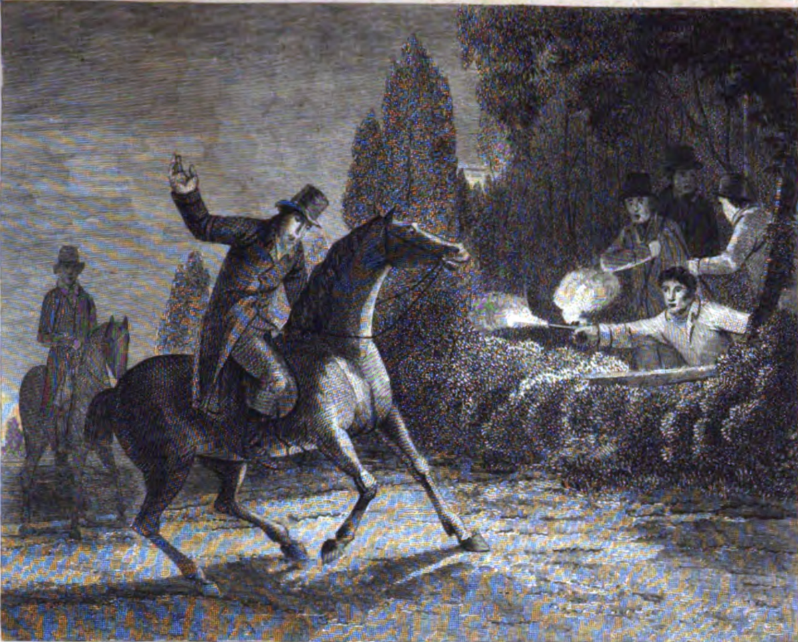

# The Shooting of William Horsfall


```{admonition} TO DO
:class: dropdown

https://www.britishnewspaperarchive.co.uk/viewer/bl/0000076/18120502/011/0003
Leeds Mercury - Saturday 02 May 1812

ATROCIOUS MURDER. On Tuesday evening last, at about half past six o'clock, as Mr. WILLIAM HORSFALL a very extensive Woollen Manufacturer at Marsden, about seven miles from Huddersfield, was returning from the market at that place, he was assassinated on the public road, on Crossland Moor.

The circumstances, as stated to us by an eye-witness of this most barbarous Murder are these:— Mr. Horsfall and a Manufacturer, of the name of EASTWOOD, had left Huddersfield together, and at a short distant before they came to the fatal spot, Mr. Eastwood stopped to water his horse, while Mr. Horsfall rode leisurely along the road; when he had came within about 500 yards of the Warren Inn, a distance of about a mile and a half from Huddersfield, on the Manchester road, four men, each armed with a horse pistol, who had just before stepped out of a small plantation, placed the barrels of their pistols in appertures in the wall, apparently prepared for that purpose; the muzzel of two of these pieces Mr. Horsfall distinctly saw, but before he had time to extricate himself from his perilous situation, they all four fired, and inflicted four wounds in the left side of their victim, who instantly fell from his horse, and the blood flowed from the wounds in torrents. A number of passengers both horse and foot rushed almost instantly to the spot, and, after disentangling his foot from the stirrup, he was some difficulty got to the Inn.

The Murderers, after they had perpetrated the sanguinary deed, walked to the distance of some yards, and soon after briskening their speed, they ran towards Dungeon Wood, and entirely escaped undiscovered, no pursuit or search having been made after them, till the arrival of a troop of the Queen's Bays, about three quarters of an hour afterwards. One of the Assassins is described to us as about six feet high, another as a low portly man, and the two others as about five feet six or seven inches high, and rather slender; they all wore dark coarse woollen coats, and appeared to be working men.

From a professional Gentleman, who was called in to visit Mr. Horsfall, we learn, that three of the wounds, out of the four, were slight, and unattended with danger, but the fourth made by a musket ball, which entering the abdomen on the left side had taken a downward direction, and lodged in the back part of the right thigh, from which it was extracted on Wednesday, along with a pistol ball, at which time, some faint hopes were entertained of the patient's recovery; but on Thursday morning, about five o'clock, a profuse bleeding came on, accompanied by mortification, by which the thigh was swollen to an enormous size, and between eight and nine o'clock that morning, he expired, in perfect possession of his faculties.

Mr. Horsfall had a very large Woollen Manufactory at Marsden, wherein about 400 work people were employed; and in a part of his premises there are Shearing Machines, which have been erected about seven years, and have attained considerable perfection; this circumstance, with the additional one of his unremitting activity in detecting, and bringing to justice the persons engaged in the attack at Rawfolds, and other Mills, had rendered him obnoxious in a high degree to the machine destroyers, who knowing his premises were too well defended to justify an attack on his property, committed a crime against his person, that will embitter every future day of their existence, and, that will, in all probability through the retributive justice of that Being, from whom no secrets are hid, bring the blood-stained perpetrators of this worst of crimes, to an ignominious end.

A reward of £2000 will, we understand, be offered immediately to any person who will give such information as will lead to the conviction of any one or more of the four men concerned in the murder of Mr. Horsfall. 
```

```{admonition} TO DO
:class: dropdown

https://www.britishnewspaperarchive.co.uk/viewer/bl/0000076/18120509/008/0003

Leeds Mercury - Saturday 09 May 1812

Huddersfield, May 7, 1812  

MR EDITOR—I am sorry to inform you the Luddites have been very active in collecting arms this last week, and have been too successful. They proceeded to peoples' houses, in the townships of Almondbury, Wooldale, Farnley, Netherthong. Meltham, Honley, and Marsden, and many other places in this neighbourhood; they entered the houses by about 20 or 30 in a gang, and demanded all the arms in the house, on pain of instant death. By this means they have obtained possession of upwards of 100 stand of arms since my last letter to you, and not one night has passed without some arms having been so taken. In order to check this alarming evil, Major Gordon has obtained possession of 200 stand of arms from the inhabitants in this neighbourhood; the military are in this manner daily employed in collecting arms, but they have not yet been fortunate enough to discover the depot of the Luddites.

A person, who appears a very suspicious character, was apprehended in Saddleworth, last Tuesday. and committed to Towzer here, and who will undergo an examination before the magistrates here tomorrow.

The Coroner's Inquest sat on the body of Mr. Horsfall last Thursday, and returned a verdict of *Wilful Murder* against some person or persons unknown. He was interred at Huddersfield parish-church, in a very private manner, last Saturday morning— few people knew till the funeral was over. It is presumed the business will be carried on at Marsden as usual.

You was misinformed with respect to Major Gordon's stable set on fire; the stable belonged to Mr. Allen Edwards, King-street, who wishes this mistake to be rectified; Mr. Edwards is a special constable, and had rendered himself obnoxious to the incendiaries by the vigilant discharge of his duty.
```


```{admonition} TO DO
:class: dropdown

https://www.britishnewspaperarchive.co.uk/viewer/bl/0000076/18120711/011/0003

Leeds Mercury - Saturday 11 July 1812

We have considered it our duty to inquire, with more than ordinary diligence, into the reports of discoveries made, and excesses committed in this county, during the last ten days, some of which, in a very exaggerated form, have found their way into the London Papers, and the following is the result of our inquiries:

On the 20th ult. the Luddites, about twenty in number, entered the house of Mr. John Wood, a shopkeeper at Huddersfield, and carried away a pistol and a small cask of gunpowder. On Friday the 3d est. parties of the same description, entered the houses of Mr. Benjamin Dyson and Mr. Wm. Mellor, of Stainland, near Halifax, and took from each a gun and a sword. The same night, another party, about ten in number, armed and disguised, several of them with their shirts over their coats, attacked the family of Mr. Megson, a carpenter, residing near the Porter's-Lodge, at Whitley-Hall; after securing the family in a back room, they proceeded to rifle the drawers, and took away four Guinea Notes and some provisions. They did not demand any fire-arms. A person of the name of Patrick Doring, alias Dr. Bell, of Scholes, near Holmfirth, was apprehended on Tuesday, and was the following day committed to York Castle on a charge of endeavoring to intimidate witnesses from appearing at York in evidence against the rioters at the ensuing Assizes. —A person of the name of Barrowclough, of Holmfirth, a Corporal in the Upper Agbrig Local-Militia, has been apprehended, charged on his own confession, with having been concerned in the murder of Mr. Horsfall, and with having assisted in the attack on the Shearing Mill of Mr. Cartwright, at Rawfolds; but it appears, on investigation, that Barrowclough was at York with the regiment at the time the murder took place.— This singular infatuation of accusing himself of crimes of which he is not, and could not be guilty, is attributed to a mental infirmity under which he is said to labour when he has "put an enemy is his mouth to steal away his brains." The story in the London Papers about the apprehension of 50 men, &c. is an entire fabrication, though two Police officers have been in that neighbourhood in disguise for some time, and the Military, both horse and foot, are very active, and were on duty all Wednesday night.
```


https://britishnewspaperarchive.co.uk/viewer/bl/0002593/18120707/021/0004
General Evening Post - Tuesday 07 July 1812

A Sheffield Paper of Saturday says—"At a late hour last night we received highly important and very gratifying intelligence to every friend of peace and good order. It states that two Bow-street Officers have been in the neighbourhood of Huddersfield for nearly three weeks past, and that they had been *twisted in*, or in other words had taken the oath of the Luddites. By this means, they have learned the proceedings and ways of these infatuated persons, and have obtained the knowledge of the depot where arms were concealed. Warrants were yesterday (Friday) issued for the apprehension of fifty of the ringleaders, and in the course of the day a great number of them were taken into custody. The actual murderer of Mr. Horsfall was discovered in a house about eight miles from Huddersfield, and is committed to Lancaster Castle to be tried for the said barbarous deed. He was seized yesterday morning about two o'clock within the county of Lancaster. The Queen's Bays were on duty during the whole of Thursday night and yesterday morning; and the Scotch Greys have arrived from Manchester to assist in this business. From the whole of this information we are led to believe, that the Secret Committees appointed by Parliament have recommended the executive Government to immediately issue authority for the Magistrates in this Riding, and in the county of Lancaster, to seize the papers, arms, &c. and to apprehend the principals and abettors of those outrages which have so lone disturbed so great a share of the country's peace."

    


```{admonition} TO DO
:class: dropdown

https://www.britishnewspaperarchive.co.uk/viewer/bl/0001255/18120714/011/0003

Public Ledger and Daily Advertiser - Tuesday 14 July 1812

[Previous story above syndicated with a different closing and reference to Barrowclough being taken to Manchester.]

A person of the name Barrowclough, of Holmfirth, a corporal in the Upper Agbrig Local Militia, has been apprehended, charged, on his own confession, with having been concerned in the murder of Mr. Horsfall, and with having assisted in the attack on the Shearing Mill of Mr. Cartwright, at Rawfolds; but it appears, on investigation, that Barrowclough was at York with the regiment at the time the murder took place. This singular infatuation of accusing himself of crimes which is not, and could not be guilty, is attributed to mental infirmity under which he is said to labour. On the arrival of Barrowclough at Manchester, where he was taken for examination, for the purpose of placing him at a distance from his connections, he informed the Magistrates that there were two depots of arms, accumulated the disturbers of the public peace, one of them in the neighbourhood of Holmfirth, and the other near Grange Moor. On this information, about 300 of the Scotch Greys were dispatched from Manchester, Wednesday, into the Riding, and all the force in Huddersfield, civil and military, was ordered to co operate with the Greys in the seizure of the concealed arms; but after spending the whole night in a fruitless search, they returned to their quarters without making any discovery whatever. Having stated these facts, it is scarcely necessary to add, that the rumoured apprehension of 50 conspirators and of important discoveries made the police officers, is a mere fabrication —Leeds Mercury.

```


https://britishnewspaperarchive.co.uk/viewer/bl/0000268/18120511/028/0003
Leeds Intelligencer - Monday 11 May 1812

(also in the editions of 18 May and 25 May)

Whereas it has been humbly represented unto His Royal Highness the Prince Regent, that on the Night of Thursday the Twenty-third of April, 1812, about Nine o'clock, as ISAAC RAYNOR, of Linthwaite, in the West Riding or the County of York, was returning Home from Milnsbridge, in the said Riding, in an enclosure called RYCROFT FOOT, he saw Three or more People near the Road, and upon his going towards them, one of them presented a GUN or other FIRE ARMS, and discharged the Contents thereof at him, that he heard something whistle past him, and upon getting Home, found that a Ball or some such Substance had passed through his Hat.

His Royal Highness, for the better apprehending and bringing to Justice the Persons concerned in the said FELONY, is hereby pleased, in the Name, and on the Behalf of His Majesty, to promise His Majesty's most gracious Pardon to any one of them, (except the Person who actually fired off the Gun or Fire Arm), who shall discover his or their Accomplice or Accomplices therein, so that he, she, or they, may be apprehended and convicted thereof.

And as a further encouragement, a Reward of ONE HUNDRED POUNDS is hereby offered to any Person making such Discovery as aforesaid, (except as before excepted) to he paid on the Conviction of any one or more of the Offenders. by J. Ratcliffe, Esq. of Milnsbridge-House.

https://britishnewspaperarchive.co.uk/viewer/bl/0000268/18120907/036/0003
Leeds Intelligencer - Monday 07 September 1812

Leeds, September 7. We feel sincere pleasure in being enabled to state, that for several days past, the Magistrates of Manchester, have been humanely exerting themselves towards those unfortunate and deluded men called Luddites, numbers of whom have applied voluntarily to take the oath of Allegiance, and to be absolved from the injunction of that dreadful bond which, under the late system of terror and riot, they had become parties to. That the great mass of those who were *twisted in* did not comprehend the nature ot the connexion they were admitted into, is well ascertained; they have expressed it; and that they were the innocent dupes of more designing men. But if a doubt remained of the existence of a plot of a dangerous tendency, it is now removed by a knowledge of the fact. The Magistrates of that district are daily applied to at their own houses, to fulfil the benevolent intention of Government, in receiving back to sober reason and morals, the deluded and mistaken objects of nocturnal association; and are always employed in their pubic capacity, at the New Bayley Court-House, on appointed days in the same charitable object.

https://britishnewspaperarchive.co.uk/viewer/bl/0002309/18121024/012/0003
Westmorland Advertiser and Kendal Chronicle - Saturday 24 October 1812

George Mellor, of Longwood Bridge, clothdresser, charged with being strongly suspected of having, on the 29th day of April last, fired at, and shot Mr. William Horsfall, of Marsden, deceased, upon the King's highway; James Varley, of Lockwood, cloth-dresser, charged with having feloniously stolen and carried away divers guns, the property of William Newton, of Hagswood Hill. Joseph Brook. of Rastrick. tailor, charged with having burglariously broke and entered the dwelling-house of Benjamin Strickland, and feloniously stoles thereout out silver watch, one pocket-book, &c. have been committed to York Gaol.


https://britishnewspaperarchive.co.uk/viewer/bl/0000172/18130116/029/0006
Leicester Chronicle - Saturday 16 January 1813

EXECUTION.

The execution of these unhappy men took place on Friday se'nnight, at nine o'clock, at the usual place behind the Castle, at York. Every precaution had been taken render every idea of a rescue impracticable. Two troops of cavalry were drawn up at the front of the drop, and the avenues to the castle were guarded by infantry. Five minutes before nine o'clock, the prisoners came upon the fatal platform. After the ordinary had read the accustomed forms of prayer these occasions, George Mellor prayed for about ten minutes; he spoke with great apparent fervency and devotion, confessing in general, the greatness of his sins, but without any allusion the crime for which he suffered. He prayed earnestly for mercy, and with pathos that was affecting. The surrounding multitude were evidently affected.—William Thorpe also prayed, but his voice was not so well heard. Smith said little, but seemed to join in the devotion with great seriousness. The prisoners were then moved to the front the platform, and Mellor said, "Some of enemies may be here, if there be, I freely forgive them, and all the world, and hope the world will forgive me." William Thorpe said, "I hope none of those who are now before me, will ever come this place." They were executed in their irons. They appeared slightly convulsed for few moments.

The number people assembled in York, was much greater than is usual on these melancholy occasions, but not the slightest indication of tumult prevailed, mid the greatest silence reigned during the whole of this solemn and painfully lamentable scene.


--

https://archive.org/details/yorkcastleinnin00redegoog/page/n25/mode/1up
York castle in the nineteenth century; being an account of all the principal offences committed in Yorkshire from the year 1800 to the present period, with the lives of the capital offenders ..

Murder of Horsfall (poor quality)

https://ia800603.us.archive.org/BookReader/BookReaderImages.php?zip=/33/items/yorkcastleinnin00redegoog/yorkcastleinnin00redegoog_tif.zip&file=yorkcastleinnin00redegoog_tif/yorkcastleinnin00redegoog_0026.tif&id=yorkcastleinnin00redegoog&scale=4&rotate=0

https://books.googleusercontent.com/books/content?req=AKW5Qad_jgKES8wcJHVxM4W7Kk7YEuqz5vOx3K_S06dXS5X3WdBVcTI0q9q7S6BI9ugKp9SWFWnr7TdHMIckc_x-UW_DYMkHgoWsRr-nPrtDyNkmKkrgIHG20PYv7fVLsj5BXHuINEbV0jxs1ZfiEp_umEw5FzB9aVpOsYrzYi-RRrG21a2g5GZmgIdeZ7LDQ2h5fxmyrsLLR-oCMl2sG73vTq8Y8ddDd1ESmIIOdZO_a6xKl0dhIzN3CN-nAEP4OuAbpJrIMROtW9e9LNdWwsmt0U7nOVb4SL9KEJeao5iSppNxrDcgo_8



--

https://britishnewspaperarchive.co.uk/viewer/bl/0001099/18130115/048/0004
Nottingham Gazette - Friday 15 January 1813

YORK SPECIAL COMMISSION OF ASSIZE.

*Before Baron Thompson ami Mr. Justice Le Blanc.*

After the Grand Jury were sworn, Baron Thompson in his charge, observed, "that they were assembled at a season of the year unusual for the solemnities of justice.—The various acts of outrage that have been perpetrated on the lives and property of individuals, require the necessity of investigating the circumstances which have lately disturbed the public peace. —The commencement of these destructive proceedings originated in a neighbouring county, *(we suppose the learned Judge allude to Nottinghamshire,)* and had at first for their object the destruction of machinery, which, by diminishing the quantity of human labour in our manufactures, was supposed by them to be inimical to the interests of the labouring classes; a notion probably infused into their minds by some evil-disposed persons, for the worst of purposes.— But more fallacious and ill-founded argument cannot be conceived.—It is to machinery that we probably owe the existence, certainly the excellence and extent of our manufactures.—Whatever lessens the expence of preparing an article by diminishing its price, promotes its and increases the demand for it; and if the use of machinery was discontinued, our manufactures would be destroyed.—The spirit of insubordination quickly spread, and reached the West Riding of this county, and from the destruction of machinery used in manufactures, the transition was easy to the destruction of buildings: the destruction of buildings led the stealing of fire-arms, to carry on their daring designs, and from the stealing of arms to indiscriminate plunder of every kind of property, and even to murder itself. Innocent and useful men have suffered their persons and property from this violence and these depredations, and some of them under circumstances which carried with them the utmost terror and alarm.—But the worst feature is yet behind, that of a most daring assassination, the murder of Mr. Horsfall in open day, as he was returning from Huddersfield. —He was fired at from behind a wall, a few miles from Huddersfield, by several persons, and severely wounded; of which wounds he died within a day or two.—With this murder several of the persons in the calendar stand charged.—In this case, as well as some others, it may necessary to submit to your consideration the testimony of an accomplice; you will attentively consider in what respects his evidence is corroborated and rendered worthy of credit, by other circumstances.

"Several changes, (said his Lordship,) will probably be brought before you, and preferred for burglaries and robberies force and violence, day and by night, as well as for maliciously shooting, which has been rendered a capital offence in the present reign: on these cases I do not know that it is necessary to make any observations; you will dispose of them according to the evidence. —There is another species of offence deserving of your most serious attention, that of administering unlawful oaths. No person who seriously reflects on the infinite mischief which may result to society, from men combining in associations under the sanction of an oath, can consider these punishments in the least degree too severe. I feel a perfect confidence that the country may safely rely upon your vigilance and attention, and that no indignation excited by the consideration of atrocities which have been committed, will excite in your minds any prejudice, when you are weighing the evidence [of] any individual, whose case may come under your consideration, and which you will determine solely by the evidence laid before you. I cannot conclude without recommending to you, that your earnest endeavours may be constantly exerted to induce a spirit of subordination and obedience to the laws, and to confirm all within the sphere of your influence, in their allegiance to His Majesty's throne; which is the only effectual means of preserving the peace, prosperity, and happiness of the country."

*John Swallow*, *John  Batley*, *Joseph Fisher*, and *John Lamb* were on Tuesday tried on a charge of burglary, in obtaining entrance by threats of violence into the dwelling-house of Samuel Moxon, of Brightfield, and stealing therefrom several promissory notes and some other articles. The facts were clearly made out against them, and the jury found them guilty, but recommended John Lamb to mercy, on the ground that he was not armed or disguised, and that he appeared to act under the influence of Swallow.

*George Mellor*, of Longroyd Bridge, cloth-dresser, aged 22; *William Thorpe*, of Huddersfield, 23; and *Thomas Smith*, of Huddersfield, 22, were indicted for the wilful murder of Mr. William Horsfall, merchant and manufacturer, at Marsden, in the West Riding of the County of York, on Tuesday, the 28th day of April, 1812.

Mr. PARKE, in his address to the Jury, took notice of the reasons which induced these deluded criminals to mark Mr. Horsfall as an object of their vengeance. He was a manufacturer to a considerable extent in Woollen Cloths, at Marsden, wherein about 400 work-people were employed, and in a part of his premises there are Shearing Machines, which have been erected about seven years, and have attained considerable perfection; this circumstance, with the additional one of his unremitting activity in detecting and bringing to justice the persons engaged in the attack at Rawfolds and other Mills, had rendered him obnoxious to the Machine-destroyers, who knowing his premises were too well defended to justify an attack upon his property, committed a crime upon his person. Nothing could be more ill founded than the idea, that the introduction of machinery into our manufactories, lessens the quantity of human labour, and abridges the means of subsistence. The very reverse of this is the truth. It greatly increases and enlarges both. Mr. Horsfall, the deceased, was a man of warm feelings, and who seeing the fallacy and absurdity of the prejudices against machinery, hud declared his intention of resisting the attempts of the daring violators of the law, and of supporting the machinery attempted to be put down by violence; in consequence of this, it was determined that he should taken off.

Mr. Parke proceeded to review the evidence which would be brought forwards to substantiate the crime upon the prisoners, "that although the accomplice, Benjamin Walker, was a very wicked man, and equally guilty with the rest of the prisoners, I shall not ask you to convict the prisoners on his testimony only, I shall confirm it by a chain of strong and well connected circumstances, all tending to establish the guilt of the prisoners. But it is not necessary that an accomplice should be confirmed in every circumstance; had that been the case, his evidence would be unnecessary, and we should have not taken him from that bar and placed him in the witness box, but have left him to the fate his crimes deserved. This accomplice will state to you, that in the shop in which he worked at Longroyd Bridge, a short distance from Huddersfield, conversations of the most inflammatory kind passed with respect to the transactions at Nottingham, which these men were unfortunately in the habit of *reading in the NEWSPAPERS*, and of the attack upon Mr. Cartwright's mill, in which some persons were killed and wounded, on which occasion, George Mellor, the first of the prisoners named in the indictment, said that he was determined to have Mr Horsfall taken off. But the accomplice knew nothing of the time until the very same afternoon when this threat was carried into execution: the proposal took him by surprise; he consented to accompany them, and had a pistol given to him by Mellor, who himself had large horse pistol loaded almost to the top. This pistol he had borrowed; that he put into it a treble charge of powder, that he then put in a ball as large as a musket ball, two slugs and another ball, all of which he rammed down into the pistol; the person who observed this extraordinary conduct, said "you not mean to fire that pistol I hope!" He replied, "Yes, I mean to do for Horsfall; will you go with us?" Thorp, the second prisoner, was also seen to load a pistol at Wood's shop, the place where all the prisoners worked. It will, no doubt, strike you as singular, that declarations of this kind should be made in so open a manner; but it proves the dreadful state in which this part of the country was in, when a murder could be talked of with so little caution and disguise. The accomplice rather objected to go, but afterwards consented to be of the party, and he and Smith went to the fatal spot together. As they were going, Walker, the accomplice, again expressed a wish not to go, and proposed to Smith to return. Smith said "nay, let us go forward and endeavour to persuade Mellor and Thorpe not to do it; but if we turn back we shall be shot." In a short time, the word was given that Horsfall was coming, and Mellor and Thorp fired—and immediately ran past Smith and Walker, and said they were flats. They then all of them run through plantation across some fields to Dungeon Wood They here separated, and Smith and Walker went to Honley. Mr. Parke proceeded to state various declarations made by Mellor and Thorp distinctly admitting that they had perpetrated the deed; and the following day an oath was administered by Mellor and Thorp to the work people, at the shop, to keep the murder a secret.

From the evidence of John Armitage, who lives at Crossland Moor, and keeps a public-house, called the Warren House, that Mr. Horsfall had, on the 28th of April, been at Huddersfield market, and on his return called at witness's house about a quarter past six in the evening; stopped at the door, got a glass of rum and water, treated two persons who were there, paid his reckoning, and rode away—did not stop twenty minutes at witness's, nor did he get off his horse.— Between witness's house and Marsden, there is a plantation belonging Mr. Radcliffe, and about quarter of a mile from Warren house. About a quarter past six o'clock, witness heard some children say that Mr. Horsfall had been shot. Witness and the two persons whom the deceased had been treating went out together and found Mr Horsfall about twenty or thirty yards below the plantation, sitting on the road side, bleeding very much. They got him down to Warren-house as soon as they could. Mr. Horsfall died there.

Henry Parr was at Huddersfield on the 28th of April last; was upon the road between Huddersfield and Marsden, and after he had passed the Warren-house, heard the report of fire-arms; saw a person riding before him; report seemed come from Mr Radcliff's plantation; saw smoke rising at the same time, and four persons were in the plantation in dark coloured clothes; the person who was before witness on horseback, after the report fell down on the horse's chine, and the horse turned round as quick as possible; the person, who it appears was Mr. Horsfall, raised himself by the horse's main, and called out murder. As soon he called out murder, one of the four men got on the wall with one hand and two feet, and Parr called out "have you got enough yet," and he (Parr) set off to Mr. Horsfall at full gallop. Mr. H. said, "good man, you are a stranger to me, I'm shot," and was then going to fall off his horse. Mr. Horsfall grew sick; witness took hold of his arm; blood began to flow from his side. Mr. H. desired witness to go to Mrs. Horsfall's.

Bannister, a clothier, met Parr on the road galloping, who told witness that Mr. Horsfall was shot. Witness found Mr. H. on the road side very bloody.

Mr. Horton, surgeon, gave his testimony personally—he extracted a hall from the deceased, and found several wound's in the deceased's body, and had no doubt they were the cause of Mr. Horsfall's death.

Benjamin Walker, accomplice, stated that the prisoners, George Mellor and Thomas Smith, worked with him at Wood's; and in a conversation about the attack on Mr. Cartwright's mill, Mellor said there was no way to break the shear's—but shoot the master. Mellor, the day Mr. Horsfall was shot, brought a loaded pistol, and gave it to witness, and said he must go with him to shoot Mr Horsfall. The pistol was double-loaded. Witness and the three prisoners went to the plantation. Smith had a pistol which he shewed to the witness. Smith and Walker went together, and got to the plantation first—Thorpe and Mellor came afterwards. Mellor ordered witness and Smith to fire, if they (Mellor and Thorpe), missed Horsfall; witness did not fire, but heard Mellor say Mr. Horsfall was coming, and soon after heard the report of a pistol; witness was about twenty yards off; they waited at this distance till the job was done. Witness and several others who were examined upon the trial, proved, that the murder was well known amongst those *twisted in*, and an oath was taken not reveal it.

The defence of the prisoners was an alibi, but it completely failed: there facts were fully made out in evidence, and the jury after retiring about half an hour, found all the prisoners guilty.

Mr. Justice le Blanc immediately passed sentence of Death upon them, ordering them to be executed on Friday, and their bodies given to the surgeons.

The trial of the murderers lasted from nine o'clock in the morning till nine at night.

On Thursday, John Scholefield was charged with maliciously firing a loaded gun at John Hinchliffe,—was acquitted.

Hinchliffe swore positively to the fact of Scholefield shooting him, and gave a full, clear and connected narrative of the whole business; but it was given in evidence for the prisoner, that Hinchliffe had said, the day after his eye was shot out, he did not know either of the persons who had attacked him. It was also sworn, that Scholefield was in bed at the time of the attack. The prisoner was consequently acquitted. The trial lasted the whole of the day. Our readers will recollect that this prisoner was taken on board a vessel, in the Thames, about to sail for America.

On Thursday night, the grand jury came into court, and stated that they had no bill before them; on which occasion Mr. Parke said, "My learned friends and myself have examined the different cases which have not been presented to you, and, considering that many of these people have acted under the influence of other persons, we have, in the exercise of that discretion confided to us by the crown, declined at present to defer any other bills; and I hope this lenity will produce its proper effect, and that the persons on whom it is exercised will prove themselves, by their future good conduct, deserving of it; but if it is abused, proceedings against them can be resumed."

John Eadon, for administering to divers persons an unlawful oath.— *Guilty.*

John Baines the elder, butcher,—John Baines the younger,—Wm. Blakebrough,—Geo. Duckworth,—Charles Milnes, and Zachary Baines, all of Halifax, cordwainers, charged with administering, or aiding and assisting the said John Baines the elder, to administer an unlawful oath to John McDonald. —*All Guilty, except Zachary Baines, who was acquitted.*

The trial of the following eight persons concerned in the attack of Mr. Cartwright's Mill, came on about nine on Saturday morning, and lasted till a quarter past seven in the evening.—The Jury withdrew for an hour, and on their return into Court, delivered their verdict as follows:

James Haigh, Jonathan Dean, John Ogden, John Walker, and Thos. Brook— *Guilty.*

The two latter were charged with firing at persons in the mill.

James Brook, John Brook, and John Hirst.— *Not Guilty.*

There was no prosecution against Wm. Hanson, of Elland, charged with being concerned in the robbery at Fartown.

THE EXECUTION.

On Friday, about nine o'clock in morning, Mellor, Thorpe, and Smith, ascended the scaffold: after some time being spent in prayer with the Ordinary, they *each* addressed themselves to the Almighty in a manner the most penitent. The voices of Thorpe and Smith were indistinct, few expressions were heard the spectators.— Mellor spoke in most audible manner; and if all his companions had heard him, must have hearts harder than flint, if they had not been melted into tears, and resolved, by spending the remainder of their life in repentance, to atone to their country for the dreadful injuries they have inflicted on her domestic tranquility.

After dwelling a long time the sins of his past life, which he confessed to be of the blackest nature, he said, "But THOU who cast devils out of Mary Magdalen,— THOU who pardonest the thief upon the Cross,—THOU canst still save thieves, — aye, and EVEN US POOR MURDERERS!" He prayed fervently for those who were connected with him.— That they might, from the present awful scene, be led to repent of their great sins, and cease from pursuing those lawless measures which could only tend to their eternal ruin. He said,—There are many here who have come expecting to see us die *game*! Let such know that we die *penitent!* We acknowledge the heinousness of our sins, and our only hope to be forgiven is the infinite and boundless mercy of our Redeemer.

After having thus made his confessions to the Almighty, he rose from his knees and addressed himself to the spectators in nearly the following words,—"There are many here whom I know,— a many of my enemies,—some who have urged me to the commission of the crime for which I am now to forfeit my life. I freely forgive you, and all the world, and I hope the world will forgive me."—These were his last words.

After hanging the usual time, their bodies were taken to the York County Hospital, to be dissected and anatomized, agreeable to their sentence.

The views of these deluded men are pretty clearly developed by the testimony of Hinchliffe, in the case of Scholefield. The latter told Hinchliffe, that "they were waiting to get a body of men within the liberty of  Holmfirth,— they had got such a body at Huddersfield, and they waited to get a body of men at all other places, and then they might all start, in a moment, and overturn the Government!"

Meetings were regularly held, and there were delegates from Manchester, Leeds, and other places.— Scholefield, to induce Hinchliffe to be LUD, told him, "that all the officers and men, except one serjeant, in a whole regiment, were *twisted in*; besides four of the Queen's bays!" Such were the schemes of these misguided men.

 ...

 TH: see also the Attentive Hearer etc; the above seems to be made up and perhaps have been the source of the Attentive Hearer's claims. Unless they were from the same source?
