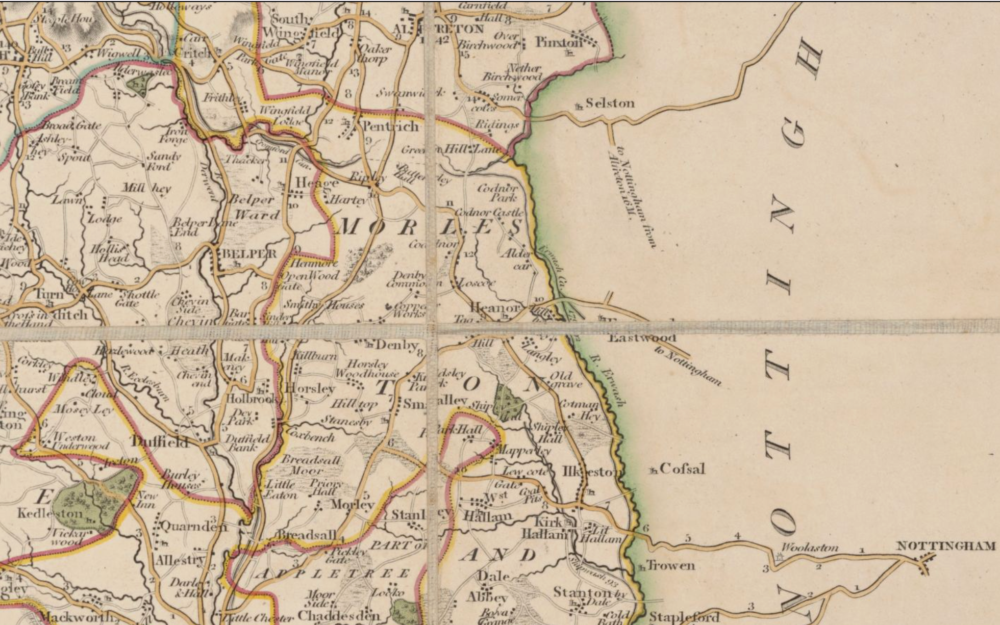
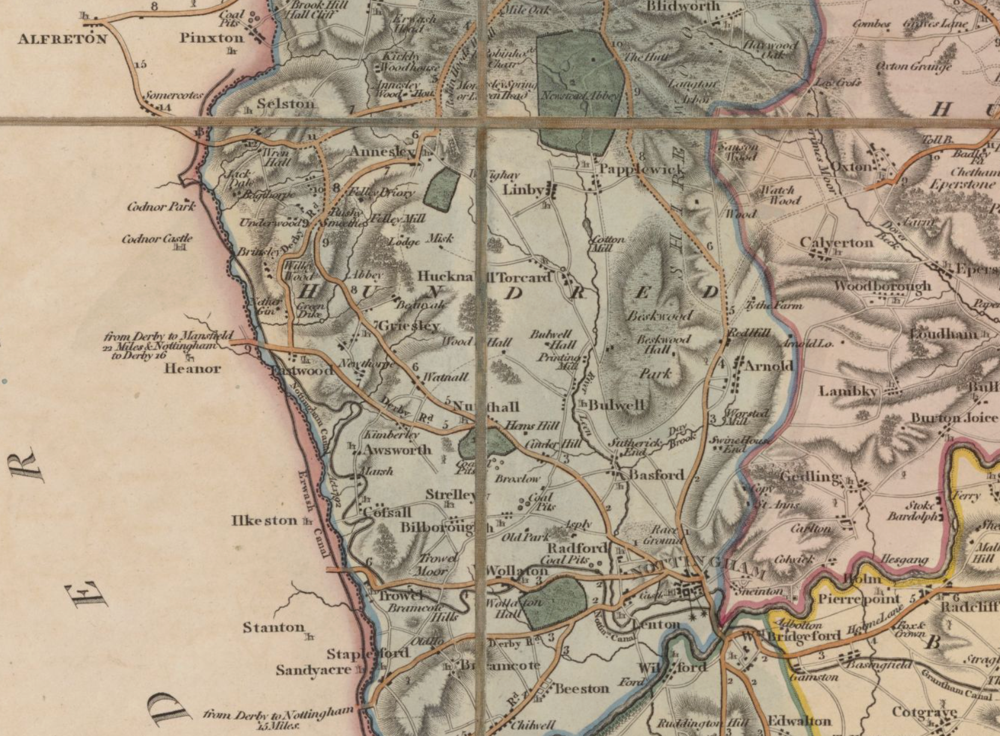

# Maps

Simple map, showing turnpike route black on white, names of key locations, simple map scale.

Maybe also try https://github.com/ColCarroll/ridge_map ?
https://claude.ai/chat/76974954-bccc-481f-b13f-f635ba3bcda9

West yorkshire map

Smith, Alfred.; Baines, Edward.Franks, J.H.,$eengraver
Title: Map of the West Riding and Ainsty of the County of York engraved for the directo...
Date: 1822.     [more info] https://maps.nls.uk/view/262720689

https://maps.nls.uk/view/262720239 (not pentrich)
Mapmaker: Cary, John, Geographer.
Title: A new map of Nottinghamshire, divided into hundreds, exhibiting its roads, river...
Date: 1818.

https://maps.nls.uk/view/262720236
Mapmaker: Cary, John, Geographer.
Title: A new map of Derbyshire, divided into hundreds, exhibiting its roads, rivers, pa...
Date: 1827. 

No online or openly licensed version of George Sanderson, Twenty miles around Mansfield, 1835 ?

https://maps.nls.uk/view/262720236 Derbyshire 1827 inc South-Wingfield, Pentrich (Nottingham) 

https://maps.nls.uk/view/262720239 Nottinghamshire 1818 inc Arnold, Radford, Bulwell  