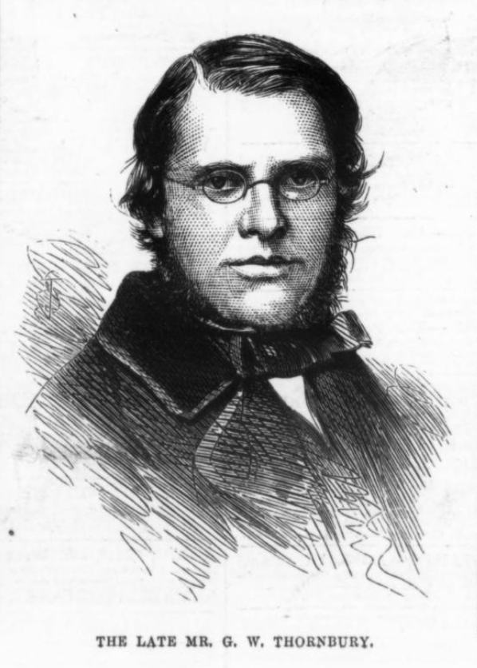

https://en.wikisource.org/wiki/Dictionary_of_National_Biography,_1885-1900/Thornbury,_George_Walter CC A-SA

THORNBURY, GEORGE WALTER (1828–1876), miscellaneous writer, son of George Thornbury, solicitor, of 16 Chancery Lane, was born in London on 13 Nov. 1828. He was educated at Cheam, Surrey, by the rector, Barton Bouchier, who was husband of his father's sister Mary. Although he was destined by both parents for the church, he resolved to become an artist, and spent some time at the academy of James Mathews Leigh [q. v.] Very soon, however, he settled down to the career of a journalist and man of letters, and achieved some reputation as a versifier, a biographer, and author of popular historical and topographical sketches. He began writing for the press at Bristol, and at the age of seventeen contributed a series of topographical and antiquarian articles to Farley's 'Bristol Journal.' At Bristol he also published a small volume of poems.

Returning to London before 1851, Thornbury joined the staff of the 'Athenæum,' his earliest contributions being a series of papers descriptive of the first Great International Exhibition. These on their completion were republished in 1851, under the title of 'The Courts of the Crystal Palace in Hyde Park.'

Soon afterwards he was associated with Dickens as a contributor to the later volumes of 'Household Words;' and when 'All the Year Round' was inaugurated, he proved 'one of Charles Dickens's most valuable contributors' (Dickens, Letters, ii. 170, iii. 239). In the service of the two periodicals he travelled widely, and wrote articles vividly depicting the United States and Palestine, the Iberian Peninsula, and European Turkey. Another series of articles in 'All the Year Round,' entitled 'Old Stories Retold,' dealt with topics like 'Trafalgar in 1805,' 'Bombardment of Algiers in 1816,' 'The Assassination of Mr. Perceval in 1812,' 'The Cato Street Conspiracy in 1820,' 'The Two Great Murders in the Ratcliffe Highway in 1811,' and 'The Resurrection Men—Burke and Hare, in 1829.' But the long series was brought to a close on account of Dickens's dislike of the sanguinary topics to which Thornbury confined the later papers. The articles were published in a volume in 1870 `[actually, 1869]`.

To the monthly magazines Thornbury was also a frequent contributor, and in later life engaged largely in art criticism. His most important independent publication was his 'Life of J. M. W. Turner,' from original letters and papers (2 vols. 1861). He wrote the whole of it under the watchful observation of Mr. Ruskin; and, as Thornbury himself remarked to the present writer, it was 'very much like working bareheaded under a tropical sun!' As the writer of half a dozen three-volume novels, Thornbury added little to his reputation. One of these novels, called 'True as Steel' (1863), was based on Goethe's 'Goetz von Berlichingen;' another, 'Wildfire' (1864), was the expansion of a sketch by Diderot, and illustrated the period of the great French revolution. Thornbury's last undertaking of importance was a popular descriptive history of London, called 'Old and New London.' The first volume appeared in 1872, and the second just before Thornbury's death. The work was completed in four additional volumes by Edward Walford [q. v.]

Thornbury died of overwork at Camberwell House Asylum, Peckham Road, London, on 11 June 1876, and was buried on the 13th at Nunhead cemetery. He married about 1872, and his young widow and three young sons survived him.

Besides the works mentioned, Thornbury's chief publications were:

'Lays and Legends, or Ballads of the New World,' 1851.
'The Monarchs of the Main, or Adventures of the Buccaneers, illustrated by Phiz,' 1855.
'Shakespeare's England, or Sketches of our Social History in the Reign of Queen Elizabeth,' 2 vols. 1856.
'Art and Nature at Home and Abroad,' 2 vols. 1856.
'Songs of the Cavaliers and Roundheads, illustrated,' 1857.
'Pierre Dupont's Legend of the Wandering Jew, translated with Critical Remarks by G. W. T.,' 1857.
'Every Man his own Trumpeter,' 3 vols. 1858.
'Life in Spain, Past and Present, with eight tinted Illustrations,' 2 vols. 1860.
'British Artists, from Hogarth to Turner: a Series of Biographical Sketches,' 1861.
'Cross Country,' 1861.
'Ice Bound,' 3 vols. 1861.
'Tales for the Marines,' 2 vols. 1865.
'Greatheart: a Novel,' 3 vols. 1866.
'Two Centuries of Song, illustrated,' 4to, 1867.
'The Vicar's Courtship,' 3 vols. 1867.
'The Fables of La Fontaine, translated into English Verse by G. W. T.,' 4to, 1867.
'The Yorkshire Worthies in the National Exhibition,' 1868.
'A Tour round England,' 2 vols. 1870. 19. 'Criss Cross Journeys,' 2 vols. 1873.
[Personal Recollections; Memoir by the present writer in the Athenæum of 17 June 1876; Boase and Courtney's Bibl. Cornub.; Annual Reg. 1876; Men of the Time, 10th ed.; Illustrated London News, 24 June 1876, with portrait.]

elsewhere in all the year round - thornton and battle of wager

https://archive.org/details/sim_illustrated-london-news_1876-06-24_68_1926
Illustrated London News - Saturday 24 June 1876

THE LATE MR. THORNBURY.

George Walter Thornbury, a well-known and popular author, whose death we announced last week, was born in 1828, the son of Mr. Thornbury, a solicitor. His numerous contributions to the literature of the day were highly appreciated; the best remembered are—"Monarchs of the Main,"Shakspeare's England during the Reign of Elizabeth," ‘Songs of Cavaliers and Roundheads," "True as Steel," "British Artists from Hogarth to Turner," "Ice Bound," "Wildfire," "Haunted London," "Old Stories Retold," and "Tales for the Marines." He was formerly art critic to the Atheneum, and, for some time, a constant writer in *All the Year Round*.

His funeral in Nunhead Cemetery took a on Tuesday week.

The portrait of Mr. Thornbury is engraved from a photograph by Mr. Charles Watkins, of Parliament-street,

https://britishnewspaperarchive.co.uk/viewer/bl/0001578/18760617/042/0007
Illustrated London News - Saturday 17 June 1876

ECHOES OF THE WEEK

...

Tuesday last I stood in Nunhead Cemetery the open grave of poor Walter Thornbury, who died on the previous Sunday, in the forty-eighth year of his age. He was buried close to the tomb of Tom Hood. Among the half-dozen persons (certainly not more) who were present at the interment of Mr. Thornbury, I failed (with one exception) to recognise face that was familiar to me. Notice had been given in that morning's papers of the time and place of the funeral; but the season is at its height, and of the hundreds of friends the poor fellow should have had, none, apparently, could spare time to show so trifling a mark of respect for his memory or sympathy with those he leaves behind as to follow his remains to the narrow house appointed for all. Walter had been toiling at the craft of authorship ever since the year 1845. He was one time the art-critic of the *Athenaeum*. He was one of the earliest and the most distinguished contributors to *Household Words* and *All the Year Round*. He was a fluent versifier, a laborious and appreciative, if not always accurate, antiquary and topographer; and in quaint, out-of-the-way knowledge of old London, its manners, customs, and traditions, he equalled Peter Cunningham. He had written two or three novels also, a Life of Turner, and multitude books of travel. He was a kind, single-hearted, genial man; but he was certainly not fortunate either in his life or in his death. *Cras nobis*, I suppose. The miserable spectacle Tuesday last made me wish, somehow, that I were eligible to become a Forester, or a Druid, or an Odd Fellow. At least, were I affiliated to one those mystic Brotherhoods, somebody would come to my funeral.

...

https://archive.org/details/pub_all-the-year-round?tab=collection&query=%22old+stories+re-told%22&sin=TXT&sort=date

https://archive.org/details/sim_all-the-year-round_1859-1878_1-20_cumulative-index/mode/2up?q=%22old+stories+re-told%22
All the Year Round  1859 - 1878: Vol 1-20 Index

Old Stories Re-told:

Assassination of Mr. Percival, xvi. 441
Attempts to Assassinate King George the Third, xvii. 118
Balloon Ascents, xvii. 44
Battle of Vinegar Hill, xvii. 205
Bombardment of Algiers, xvii. 127
Bristol Riots, xvii. 596
Brunswick Theatre, Accident at the, xx. 191
Burdett Riots, xvii. 230
Burning of Wildgoose Lodge, xvii. 417
Cato-street Conspiracy, xvi. 415
Colonel Despard's Plot, xviii. 179
Culloden, xviii. 271
Duel between Lord Byron and Mr Chaworth, xvii. 178
Earthquakes, xviii. 545
Eclipses, The Racehorse, xix. 223
Eliza Fenning, xviii. 66
Emmet's Insurrection, xvii. 537
French and the Infernal Machine, xvi. 322
First Use of Gas in London, xvii. 378
French in Ireland, xvii. 34
Gambler's Life in the Last Century, xviii. 511
Glorious First of June, xviii. 420
Great Frost of 1814, xvii. 294
Great Stock Exchange Hoax, xvii. 43
Highwaymen, A String of, xvii. 512
John Howard alias or William Courtenay, &c., xvii. 441
Life of a Methodist Preacher, xvii. 398
London Street Riots in the Last Century, xviii. 372
Loss of the Kent East Indiaman, xvi. 444
Luddites, The, xvii. 407
Massacre of the Mamelukes, xviii. 157
Murder of Mr. Weare, of Lyons Inn, xvi. 506
Mutinies in the Navy, xviii. 519
O'Connell, xvii. 53 ?Old Patch
O. P. Riots, xvii. 149
Peterloo, xvii. 559
Prison Discipline, xviii. 251
Red Barn, xviii. 397
Resurrection Men, Burke and Hare, xvii. 286
Sarah Malcolm, xvii. 589
Sheridan's Duel with Captain Mathews, xviii. 138
The Spa-fields Riots, xvi. 562
Theatrical Farewells, Garrick and Siddons, xviii. 87
Thomas Dermody Weinecourt, Poisoner, xvii. 34
Trafalgar, xviii. 108
Trial and Execution of Fauntleroy, xvi. 470
The Two Great Murders in Ratcliff Highway, xvi. 350
Wager of Battle, xviii. 3 [actually, 39]
Wager of Battle, Murder of Mary Ashford, xvii. 436
Wild Boys, xviii. 891
Wreck of the Halsewell, East Indiaman, xvii. 347
Wreck of the Medusa, xvii. 77
Wreck of the Rothsay Castle, xviii. 203

series in all year round 1866-8, more in 1871-2

also 

https://archive.org/details/hauntedlondon00thor
Haunted London
by Thornbury, Walter, 1828-1876; Fairholt, F.W. (Frederick William), 1814-1866

Publication date 1865

-- 

https://britishnewspaperarchive.co.uk/viewer/bl/0004596/18691228/020/0003
Echo (London) - Tuesday 28 December 1869

OLD STORIES RE-TOLD. `["Old Stories Re-told." By Walter Thornbury, London: Chapman and Hall.]`

Mr. Thornbury has dealt, in his "Old Stories Re told," very pleasantly with a very unpleasant series of subjects. He tells us of the Luddites and their outrages; of Thurtell, the gambler, and the cruel murder he perpetrated: of Sarah Malcolm, the murderess of her mistress; of old Patch, the forger; of the fatal duel between Lord Byron the grand uncle of the great poet of the same name and Mr. Chaworth; of the great banker and forger, Fauntleroy, and of the mysterious murder of Mary Ashford. Then we have a very black list of political offences and political offenders, where we find an account of Emmet's insurrection, in 1805, and the Irish Rebellion in 1798, the assassination of Mr. Perceval, the Prime Minister, in 1812; the burning of Wildgoose Lodge co. Louth, Ireland, in 1816; the Cato-street conspiracy in 1820, and the Bristol riots of 1834. When we add to these crimes the catastrophes of the wreck of the *Medusa*, in 1816, anf the loss of the *Kent* East indiaman by fire in 1829, and a few murders and other atrocities of lesser note, we shall have presented our readers with the whole subject-matter of Mr. Thornbury's most interesting volume. To be, however, appreciated as a whole it must be read as a whole. It is impossible to read these terrible pictures of depravity and disaster without being deeply impressed with the consolatory reflections. In the first case, we are made to feel that human nature, even in its most corrupted phases, is still *human*, and not *devilish*, and that even some of the blackest criminals have some soft spot in their hard hearts, and are capable of acts of kindness, as well as susceptible of sincere religious feelings. It is to the credit of our author, and, we may add, to the delight of his readers, that so many cases are here pointed out in this dark calendar of crime which what is excellent in human character is mingled with what is corrupt. As no man is altogether good, so we believe that no man is altogether bad, and that he is the best man who has the greater proportion of what is best, and he the worst who has the greatest proportion of what is worst in human character.

To our mind, the bright bits of redeeming sunshine thrown on the dark characters of his criminals is by far the best portion of these stories retold, and of this we will give our readers the benefit of a few examples. Fauntleroy, the well-known London banker, was hanged, as we before observed, for forgery, in 1824. This unhappy man found the banking firm deeply involved when he entered it as a partner in 1817. His forgeries were made to retrieve the position of the bank. "He *never had embezzled* one shilling," we are told, "for himself." Witnesses of the highest respectability were produced at his trial who had known him for a life time. All gave evidence to his honour and to his integrity. "A most benevolent man, with a stainless character." Death was, we must confess, a very hard doom for a man of otherwise spotless reputation, whose only crime was a dishonest effort not to enrich himself, but to maintain the credit of others. Here is a "ghastly anecdote" told of poor Fauntleroy, which we give in our author's own words:—

"A ghastly anecdote, illustrative of the deep sincerity of dinner-friendships, and the profound attachment whereof boon companions are capable, long survived this miserable man, and was, within these twenty years, told for truth by one of his generation. His elegant dinners had been particularly renowned for some remarkable and unmatchable Curacoa. He had been frequently asked at his own table of whom he bought it, but always kept the secret. When he was ordered for execution, three friends, bound to him by the remembrance of many feasts and many glasses of this famous liqueur, had a parting interview with him in his Condemned Cell. They had discharged themselves of such edifying remarks as they had brought with them, and had taken their final leave of him and were about to retire, when the most impressive of the three stepped back, and said 'Fauntleroy, you stand on the verge of the tomb, and Eternity awaits you. We brought nothing into this world, and it is certain we can take nothing out. At so supreme a moment, have you any objection to say how, and of whom, you procured that Curacoa?'"

In the murderer Burke (the Resurrection man), it is not less singular than pleasing to note his friendly care and anxiety for his wife, which is not forgotten in this sombre record of appalling horrors. Thurtell—the villain who murdered Mr. William Weare in 1823, in conjunction with Hunt, who turned King's evidence—had the noble generosity to forgive the man who brought him to the gallows, and the night before his execution he shook him cordially by the hand, and said, "God bless you, Hunt; you have brought me to this situation, but I freely forgive you, and hope you will be reprieved and live to repent of your past errors. If you had had nerve like us, none of us would have been convicted of this crime, but I forgive you from the bottom of my heart."

The story of Sarah Malcolm, who murdered her mistress—a rich widow, Mrs. Duncombe—is, in truth, a sad story, but still relieved from something of its ghastly gloom by such an incident as the following:—

"It was the custom at this time, pursuant to a bequest of Robert Dowe, a merchant tailor, for the bellman of St. Sepulchre's to come to Newgate a little past the midnight before the execution of prisoners, to ring his bell under the grated windows of the condemned hold, repeating the following well-meaning but doggrel verses:

"'All you that in the condemn'd-hold do lie,  
Prepare you, for to-morrow you shall die.  
Watch all and pray, the hour is drawing near,  
That you before th' Almighty must appear,  
Examine well yourselves, in time repent,  
That you may not t' eternal flames be sent:  
And when St. 'Pulchre's bell to-morrow tolls,  
The Lord above have mercy on your souls!   
Past twelve o'clock!'"

Some prisoner or turnkey speaking to Sarah Malcolm, and bidding her mind what the bellman said, she replied that she did. When the bellman finished, she looked out of window, and cried—

"'D'ye hear, Mr. Bellman, call for a pint of wine, and I'll throw you a shilling to pay for it.'

"She then threw down the shilling.

"On the Sunday night, about ten o'clock, she called to a man named Chambers—the prisoner condemned to die the next day, and whose cell was opposite her window—and asked him if she should pray with him. He replied—

"'Do, Sarah: let us pray with all our hearts.'

"She then prayed fervently till all the candles were burnt out, and then exhorted him not to go to sleep, but to spend the night in prayer to God for his forgiveness."

Then the inhuman atrocities of the Irish Rebellion of '98 give us the following glimpse of the true charity that beats in a good man's heart even in the wildest delerium of political frenzy and excitement.

"Six Protestants out of ten had been already impaled, when Father Corria came running up to save the residue. Finding all his arguments useless, the priest at length took off his hat, and desired the murderers to kneel down with him and pray for the souls of the poor prisoners before they put them to death. Having got them in this attitude, he said:

"'Now pray to God to have mercy on your owm souls, and teach you to show that kindness towards these men which you expect from Him in the hour of death and in the day of judgement.'

"He then rose and led the Protestants back to prison unopposed. The massacre ceased about eight o'clock in the evening; out of forty-eight in the market-house only nineteen had escaped."

https://britishnewspaperarchive.co.uk/viewer/bl/0000686/18691211/213/0006
Yorkshire Post and Leeds Intelligencer - Saturday 11 December 1869

OLD STORIES RETOLD `[Old Stories Re-told. By Walter Thornbury, author of "Haunted London," &c., London: Chapman & Hail.]`

TO DO

It was but the other day that reviewed admirable novel—"The Vicar's Courtship" by Mr Walter Thornbury, and now another book, of a different character, by the same versatile and industrious writer, lies before us. It is, as the title indicates, a collection of old stories retold—stones of actual events, episodes of social and political history—great crimes, memorable battles, terrible disasters sea and land, riots, rebellions, conspiracies, and so forth-which, remarkable as they are, and forcibly as they must have impressed themselves on the minds of men when they occurred, have gradually faded from memory, until nothing is left of them but their barest outlines, and in some cases only their mere names or titles. It indeed strange how soon events the most memorable become forgotten. How many persons, to take some of Mr Thornbury's subjects as examples, remember the circumstances of the O. P. Hints of 1809. of the assassination of Mr Percival 1812, of the wreck of the Medusa in 1816, of the murder of William Weare Thurtell in 1823, of the burning of the Kent East Indiaman in 18251 Again, perhaps ninety-nine out of a hundred selected at random from any large crowd or company, could not tell what was the cause and result of the duel between Lord Byron ami Mr Chaworth in 1765, and we undertake to say that not a few would be puzzled, if asked to state whether the Lord Byron in question was the poet of not. How many persons can name the date of the battle ot Vinegar Hill and the nationality and objects of the parties engaged in it, or have idea of the purpose the Cato Street Conspiracy, or of the crimes tor which Fauntleroy was executed in 1824, or know what instigated the Bristol Riots of 1831, or what was their extent and effect But so it will be with the events passing under our own eyes, and in the course of a few years the memory of the wordsds I will lose its grasp of the details of such familiar facts the loss of the Royal Chatter, the murder of Mr Briggs by Muller, and of Mrs Sheward by her husband, the Fenian conspiracy and the shooting of Police-sergeant Brett at Manchester, and the outrage at Clerkenwell, the Reform League riots H.\de Park, and the Pantin massacre, together with all tbo moral lessons which these incidents suggest. One of these days, perhaps, the events of our own times will be dealt with Mr Thornbury has dealt with the events that excited society those of our fathers of the past three generations. To an able writer like him such subjects will furnish tempting themes, and, probably, the success with which he has revived tho forgotten half-forgotten stories he has re-told may induce others to follow in his footsteps. If any doubt could exist as to the propriety or expediency of resuscitating these stories, it is removed the manner in which the resuscitation has been effected. Mr Thornbury certainly is not one of those who "mars a good story in the telling." master of the art of graphic description he has few rivals, and he has shown his skill in this respect in no work more remarkably than in the vblumc before us. His style of narration is simple, without being commonplace or dry ; it is dramatic without being vulgarly sensational. He embellishes his subject not by flights of the imagination, but the sheer force of picturesque treatment. In perusing these stories his one cannot fail to be struck by the seeming paradox—that there is at once so much and yet so little of his own in them. But this is because, while he adheres closely to truth and fact—while his book is, it were, crammed (if such a term can be applied to what is perfect in order and arrangement) with historical detail, the manner of the narratives is fresh and novel as the subjects of them are old. The stories seem to tell themselves, so fertile arc their materials in interesting incident, but it is to the art of the narrator that we are indebted for the powerful and vivid impression which they make upon us. For example, what a perfect picture —conceived in the true Hogarthian spirit —is the following sketch of brutal gambler-bully of the last century: Major Oneby wait neither the Eagle nor the Woodpecker. bad sank into the lowest all gamost Bally. was the bloat, frank old soldier who talked Marlborough, by , air, and Prince Engine. had a groan humour of hie own, and told infamous stories well, when he was neither quarrelsome nor dangerous. He roared and cursed for wine Will's or the Mitre, struck the drawers, trod on people's hate, or kicked their swords sdehe to his seat. was the terror of all quiet and timidly respectable men. Hr: uied dap his sword the table, and glance round dertautly at the company. He would howl out blasphemies addressed to one specially, bat still amounting a challenge the fiercest or bravest man in the room. It was necessary to his reputation a terrorist that should kill a man now and then, and woe to the young Templar, vain his fencing, who that night came in his way. would volunteer show the young country spendthrift the sights of the town. Some evening, after three or four of wine, the Deluder pr-tend-, with his own jovial laugh, to be tired of Booth ami Q >in, Vauxhall and Kanelagh. of the Mall and the tracingschool, of the masquerade and the Park. Some people they meet by chance at Will's turn out very lively acquaintances, with torn for faro or chicken h vzard. They adjourn to a gambling-house, and set work wi'h the dice and the red and black pipe. Mr Littlebram, tho rich young gentleman from 8 first wins surprisingly. The gold tide sets towards him. They call for more Burgundy. He instate on higher stakes, astonished to find how he is startling the old dice-shakers of Covent Garden. More Burgundy; the room seems to get lighter and larger ; the dice tiy out faster and fatter. The tide at last turns; the gold floats from him in shoals. He h.'s lost all bod won and five thousand guineas more, besides the large farm near Taunton, He has also signed some papers that good-natured old lawyer pereenk required as securities for the loan of another thousand, already half gone. Gradually the fumes of the wine subside, and one suspicious glance discloses to him the old lawyer changing a pack of cards which he (novice) had placed ready at his elbow. He sees a friend make signs the benevolent lawyer. Then he feels into what a park wolves has fallen. In a moment Littlebrain dashes over his chair, leaps a settee, gets down his hat and sword from the peg behind the door, and shouts "Thieves!" from the window to the watch, who have just passed, crying, sleepily: Past four, and rainy morning," The gang is furious, their eyes glare, they prepare for a The gallant captain, whose red face, barred with black plasters, looks like a hot fire seen between the bars of a grate, sweeps two or three dozen guineas from the green cloth into his panniers of pockets. Then some one knocks out the lights, several swords clash with Littlebrain's, and one passes through his unlucky body. He staggers to the stairs, and falls headlong down them—dead. There a dash the watchmen, who threaten the gamblers with their staves. The old men, however, fall before the tempestuous charge, and the next moment there is no one in the gambling house but two frightened women, old watchman, who is bolding the dim lantern to the dead man's face with one hand, and removing his watch and purse with the other; the only sound is the wind whistling through the keyhole. In such affairs, subtle, cruel, and deadly. Major Oneby has been no subordinate actor. In nothing does Thornbury show his skill to better advantage than in tales of crime and mystery. He is not content with a mere piling up of horrors, but he constructs, even out of the most revolting of his subjects such as the butcheries of Burke and Hare, and the murders Ratcliffe Highway—tales that rise to the dignity of tragedy. In this way, his stories of crime ro- Femble not the hideous records of the Newgate Calendar, but the skillfully-elaborated narratives of Edgar Poe. We doubt whether even that accomplished historian of the terrible has ever "led up" to the climax of any of his tales of mystery with art more subtle than that which Mr Thornbury displays in many of his stories. The following thrilling narrative of the discovery of the murders by Sarah Malcolm, in the Temple, in 1733, is, in our opinion, a master piece of the art of story telling,.admirable for its play of light and shade, for the dexterity with which it seizes the attention and keeps it on the stretch of expectation, and fills the mind with sense of impending calamity Exactly one on that Sunday, Mrs L'lve, neat and trim as Quaker, comes dine in Tanfield Court. She very punctual: it is exactly o'clock the great dials, and the St Donstan giants have just done their lightest work, and struck out with their dabs, clear, and loud. Mrs Love shuffled over the paved court, and last reaches the special door with the name Lydia Duncomb in black on the door-post. N savoury smell of dinner greets her. She ascends the old dusty ink-splashed stairs;—one flight—that is Mr Knight's door. Silent, all out for the Sunday ; second flight, she reals; third flight, here is the landing at last, and welcome enough to her poor old knees. There Mr Grisly's name still over his door—be is going to leave: and facing it, again, the well-known name of Mrs Lydia pun comb. It singular, though, as they cannot all nave gone to church, that Mrs I) an comb's outer door is accident, doubt. Mrs Love knocks with the confidence of a punctual visitor, true to the dinner hour. Iso answer! It is very silent and lonesome there the top of the house, on the cold landing opposite Grisly's unoccupied chambers. chill creeping of the bl(x*l comes over Mrs Love. Five, ten, fifteen minutes' more knocking. No answer. Something must be the matter. Nanny must be out, and Mrs Betty ill in bed. too infirm to come the door, and too weak to call out load enough to heard. Down the three flights at last trots Mrs Love, see she can find anybody who has seen any one the family that morning, la the court whom should she meet but Mrs OliDhant, and she asks her at once. "No " said Mrs Oliphant, I have seen none of them ; yon'd better knock louder. Up again goes Mrs Love, feeling sure that they will now be stirring. Skill all silent up the great stairs. She knocks again, nervously fast, till the whole staircase re-echoes, and from every empty room there seem to come voice*—shadowy faint voices—but no articulate answer. She waits. No • 

https://britishnewspaperarchive.co.uk/viewer/bl/0000329/18700516/086/0003
Western Morning News - Monday 16 May 1870

OLD STORIES RETOLD. `[By Walter Thornbury.—Chapman and Hall]`

On first glancing this very interesting wad vigorously written book, we are reminded of two well-known sayings. "Fact is stranger than fiction," and "The history their own time is just that of which ordinary people are most ignorant." What writer of sensation novels, what inventor of tales of murder, forgery, and the detective police, could produce stories more thrilling than these tragedies of real life? such os that of Sarah Malcolm, the charwoman, who murdered three persons in the Temple; Old Patch, the forger of bank notes, who assumed innumerable disguises, and who seemed be, like Mrs. Malaprop's Cerberus, "three gentlemen at once;" the wholesale murders in Ratcliffe Highway, which De Quincey has immortalised in his essay on"Murder as one of the Fine Arts;" Wainwright, the art critic and dandy, who used to insure the lives of friends and near relations in various offices, and then quietly and skilfully poison them with strychnine; Fauntleroy, the high bred gentleman, and great banker, who forged deeds upon a stupendous scale, and who was hanged at Newgate? Again, all us have heard something about the burning of the Kent, East Indiaman, the Cato-street conspiracy, the bombardment of Algiers, the Luddites, Burke and Hare the resurrection men, the Bristol riots, &c. — but very few people have more than hazy and traditional ideas about these occurrences. Mr. Thornbury's book thus supplies an acknowledged want, and gives us most clear and vivid accounts of many remarkable events of the last and the present century—wrecks, riots, trials, famines, and insurrections, about which the majority of us know little but the name. Some of the author's descriptions have wonderfully graphic force, and are equal anything of the kind in the best novels the day. Here is a spirited picture of attack by the Luddite rioters upon a Yorkshire mill, worthy of being pendant to the picture of the same subject in Charlotte Bronte's "Shirley."

"Mr, Cartwright, who had apprehensions of attack, was asleep in the great stone many-windowed building. The great water wheels were still, the only sound was the ripple of the water in the mill-dam. The alarm-bell, rising above the roof, stood out dork against the sky. There was no light at any window, and no noise. five workmen and their allies, the five soldiers, ware asleep. The armed men, intent on destruction, and ready for murder, to their design stole on like ghosts. Soon after twelve, Mr. Cartwright, who had just fallen asleep, was awoke by the violent harking of a large dog, kept chained inside the mill for such purpose.

"The mill-owner leaps out of bed to give the alarms he opens his bedroom door, he hears twenty or thirty of the three hundred panes of glass on the ground floor, shattered in: the same time there is a rattle and blaze of musketry the ground and upper windows. The bullets whistle, and splinter, and flatten against the immer walls. At the same time a score of sledge-hammers are heard working the chief door, and voices shouting and threatening at the other entrances, and indeed on all sides, except that which the mill pool lies.

"The hour is come at last. But Mr. Cartwright is Yorkshire too—resolute, bold, and of a good heart. shouts his men, they fly to arms, and load and cock their muskets. He and one or two of his work-people run. to the alarm-bell and pull fiercely the rope tiu dashes out its summons to the Hussars at Liversedge, and friends near and far."

This drives the Luddites stark staring mad the firing becomes hotter, and a dozen of them cry out—

"Fire the bell-rope! Shoot away the bell! that bell, get it lads!' For they knew the soldiers would be upon them soon with their sabres if that bell clanged many minutes longer. Presently the bell-rope breaks, and two men are sent up to clash the bell and fire alternately. Cartwright and his men fire from the upper loops of the mill obliquely the howling crowd that flash off their guns, and ply their hammers, and snap their pistols the detested mill, where the ten men are glaring at them under covert. The fire from and against the mill is hot, pelting, and furious."

The story of the loss of the Kent, East Indiaman, is most noble one, and full of thrilling and pathetic details. We cannot help contrasting the chivalry and perfect discipline of the officers and men on board her, with the cruelty and cowardice of many of those belonging the wrecked French vessel Medusa, of which also Mr. Thornbury tells the tale. There are several clever touches of character throughout the volume, the descriptions Wainwright, the dilettante fine gentleman and poisoner, who "had always been fond of cats," and the grave, intensely respectable, grey-haired Fauntleroy, are especially well done. We conclude with the portrait of the Lord Byron (great uncle of the poet), who killed Mr. Chaworth in duel.

"He left Westminster Hall with the brand of Cain upon his forehead. A mysterious and indelible stain was upon h'a escutcheon. The 'maccaronies' in the world fashion somehow shunned him, a whisper suspicion followed him wherever he went He retired into Nottinghamshire, and sank into sullen, gloomy, morose man. His passions grew more inveterate; he changed into a half-crazed, revengful, brooding misanthrope, a wicked Timon of Athens. always wont armed, as if dreading secret enemies. one occasion he is said, in rage, to have thrown his wife into the lake in front of the abbey, from which she was rescued the gardener, who then thrashed her savage husband. Another time he is said to have shot his coachman for disobeying orders, then to have thrown the bleeding body into the coach where Lady Byron was seated, and driven home himself. At war with.the human race, the wicked lord in 'austere and savage seclusion,' took refuge in the love of animals. He tamed immense number of crickets, whom he allowed to crawl over him, and corrected, when too familiar, with wisp of straw. When their patron died, there is a tradition that they left the Abbey altogether, flocking across the courts, corridors, and cloisters in all directions."

https://britishnewspaperarchive.co.uk/viewer/bl/0005087/18881107/408/0047
Bookseller - Wednesday 07 November 1888
OLD STORIES RE-TOLD. (Murders, Wrecks, Conspiracies, Riots, Insurrections, Forgeries, Duels, Battles, Fires, &.) By WALTER THORNBURY. A New Edition. Post 8vo, Illustrated boards, 2s.; cloth limp, 2s. 6d.

https://archive.org/details/in.ernet.dli.2015.41560/page/n9/mode/2up?q=wight

Old Stories Retold
by Thornbury, Walter

Publication date 1888 (new edition; original 1869)

Contents

The Life of a Methodist Preacher, 1715 . . . 1

A Gambler's Life in the Last Century, 1725 . . 16

Sarah Malcolm, 1733 ...... 29

The Duel between Lord Byron and Mr. Charworth, 1765 46

Old Patch the Forger, 1784 . . . .62

The Battle of Vinegar Hill, 1798 .... 80

Emmet's Insurrection, 1803 . . . . .95

Trafalgar, 1805 . . . . . . .111

The O. P. Riots, 1809 . 130

The Two Great Murders in Ratcliffe Highway 1811 . 148

The Luddites, 1812 . . . . .  157

The Assassination of Mr. Perceval, 1812 . . , 173

The Burning of Wildgoose Lodge (Co. Louth), 1816 . 181

The Bombardment of Algiers, 1816 .... 195

The Wreck OF THE "Medusa," 1816 . . . .211

Wager OF Battle. Murder of Mary Ashford, 1817 . 228

The Cato Street Conspiracy  1820 .... 242

Thomas Griffiths Wainwright, The Poisoner, 1830 . 256

The Murder of Mr. William Wearf, 1823 . . . 274

The Trial and Execution of Fauntleroy, 1821 . . 290

The Loss of the "Kent" East Indiaman by Fire, 1825 304

The Red Barn, 1827 320

Resurrection Men — Burke and Hare, 1829 . . 335

The Bristol Riots, 1831 ..... 349

FIESCH AND THE INFERNAL MACHINE, 1835 . . . 364

## CATEGORISED

### Protest

Attempts to Assassinate King George the Third, xvii. 118
Colonel Despard's Plot, xviii. 179
Assassination of Mr. Percival, xvi. 441
Cato-street Conspiracy, xvi. 415

Burdett Riots, xvii. 230
The Spa-fields Riots, xvi. 562
Peterloo, xvii. 559
Bristol Riots, xvii. 596

O. P. Riots, xvii. 149
London Street Riots in the Last Century, xviii. 372

Luddites, The, xvii. 407

Mutinies in the Navy, xviii. 519

### Battles / War

Bombardment of Algiers, xvii. 127
Culloden, xviii. 271
Massacre of the Mamelukes, xviii. 157

### Natural World

Earthquakes, xviii. 545
Eclipses, The Racehorse, xix. 223
Glorious First of June, xviii. 420
Great Frost of 1814, xvii. 294

### Civic / Travel / Transport

Balloon Ascents, xvii. 44
Brunswick Theatre, Accident at the, xx. 191
First Use of Gas in London, xvii. 378
Gambler's Life in the Last Century, xviii. 511
Great Stock Exchange Hoax, xvii. 43
John Howard alias or William Courtenay, &c., xvii. 441
Life of a Methodist Preacher, xvii. 398
Theatrical Farewells, Garrick and Siddons, xviii. 87
Wild Boys, xviii. 891

### Ireland

Battle of Vinegar Hill, xvii. 205
Burning of Wildgoose Lodge, xvii. 417
Emmet's Insurrection, xvii. 537
French in Ireland, xvii. 34

### Duels

Duel between Lord Byron and Mr Chaworth, xvii. 178
Sheridan's Duel with Captain Mathews, xviii. 138
Wager of Battle, xviii. 3 [actually, 39]
Wager of Battle, Murder of Mary Ashford, xvii. 436

### Crime / Punishment

Eliza Fenning, xviii. 66
French and the Infernal Machine, xvi. 322
Highwaymen, A String of, xvii. 512
Murder of Mr. Weare, of Lyons Inn, xvi. 506
Old Patch, xvii. 53
Prison Discipline, xviii. 251
Red Barn, xviii. 397
Resurrection Men, Burke and Hare, xvii. 286
Sarah Malcolm, xvii. 589
Thomas Dermody Weinecourt, Poisoner, xvii. 34
The Two Great Murders in Ratcliff Highway, xvi. 350
Trial and Execution of Fauntleroy, xvi. 470

### Wrecks / Naval

Loss of the Kent East Indiaman, xvi. 444
Trafalgar, xviii. 108
Wreck of the Halsewell, East Indiaman, xvii. 347
Wreck of the Medusa, xvii. 77
Wreck of the Rothsay Castle, xviii. 203
